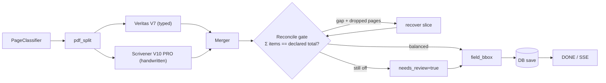

# CLAUDE.md — Project Guide for AI Assistants

## What this project is

**RO-ED AI Agent** is a Myanmar-customs PDF extraction platform. It classifies each page of a customs declaration and routes it to the right specialist (typed pages → **Veritas** / V7, handwritten pages → **Scrivener** / V10 PRO), merges results, and presents them in a side-by-side review UI for human approval. The active production pipeline is **V11 Maestro** — queue-driven (Redis + RQ), Postgres-backed, with live SSE router events. Built by City AI Team — City Holdings Myanmar. Designed for ~10 concurrent users.

## Tech stack

- **Frontend:** SvelteKit 5 (runes) + TailwindCSS 4.2 + ECharts (cost dashboard) + Vite. **Claude-inspired design system** — warm cream surfaces, clay `#CC785C` accent, Source Serif 4 headings, Inter body, JetBrains Mono code. Tokens in `frontend/src/app.css` (`:root`).
- **Backend:** FastAPI 0.115 + Uvicorn (Python 3.12, 2 workers), Pydantic v2
- **Database:** Postgres 16 (psycopg3 + SQLAlchemy QueuePool 10+10) + Alembic
- **Queue:** RQ + Redis 7 (`worker` container, `replicas: 2`)
- **Reverse proxy:** Nginx 1.27 with HTTPS (TLS 1.2/1.3 + HSTS); self-signed dev / Let's Encrypt prod
- **Auth:** Local JWT (HS256, ≥ 32 chars enforced) + multi-LDAP cascade + Keycloak OIDC (RS256, PKCE)
- **Storage:** S3-compatible (AWS / MinIO / R2 / Wasabi / Backblaze) configurable from `/settings`; local fallback. Secrets Fernet-encrypted in DB.
- **PDF:** PyMuPDF (fitz) at 300 DPI + Pillow. **No Tesseract.**
- **LLMs:** OpenRouter API. V7 typed-page vision + assembler + verifier: Gemini 3 Flash Preview (verifier switched from Sonnet → Flash for cost, see `config.py:71`). Claude Sonnet 4.6 + Opus 4.7 + Gemini Pro used in V7 holistic ensemble (hard docs) and V10 PRO per-stage (master=Opus, reader=Gemini Pro, verifier=Sonnet, filter=Haiku). V11 page classifier: Claude Haiku 4.5.
- **Rate limiting:** slowapi + Redis storage. Login 5/min, extract 10/min, global 1000/hour per IP.
- **Observability:** Sentry SDK (optional, via `SENTRY_DSN`). Integrations: FastAPI, Starlette, AsyncIO, Redis, SQLAlchemy, RQ.

## Pipeline architecture (V11 Maestro)

```
PDF upload (browser)
  → POST /api/extract-v11      (returns 202 + {stream_id})
  → backend/jobs/queue.py      (enqueue RQ on Redis)
  → backend/worker.py          (RQ worker container picks job)
  → backend/v11/workflow.py    Maestro orchestrator:
       1. PageClassifier        → per-page verdict: PRINTED / INKED / EXTRA
       2. pdf_split             → route pages by verdict
       3. PARALLEL:
            ├─ Veritas  (V7  pipeline, backend/pipeline/)   typed pages
            └─ Scrivener (V10 PRO,     backend/v10_pro/)    handwritten pages
       4. Merger                → combine declarations + items
       5. field_bbox            → fitz.search_for() → highlight rects
       6. DB save → DONE
  → SSE /api/extract-v11/stream/{id} streams:
       JOB_START, CLASSIFY, ROUTE,
       STAGE_START, STAGE_DONE,
       MERGE, RECONCILE, DB_SAVE, DONE, FAIL   (Redis pubsub channel `job:{id}`)
```



**Reconcile gate** (`backend/v11/tools/reconcile.py`, wired in `workflow.py` Phase 4.25 + 4.4): the one invariant every pipeline funnels through — declared `total_customs_value` must equal Σ item customs values. On gap + ATTACHMENT pages, re-extract the dropped slice; if still unbalanced, force `needs_review=true` + `cross_val_passed=0`. Never ship a silent gap. Tunable: `RECONCILE_TOLERANCE_PCT` (5), `RECONCILE_RECOVER` (on).

V7 (legacy sync) is still mounted at `POST /api/extract` for external integrations. V10 PRO standalone at `POST /api/extract-v10-pro` is kept for HW testing. **All UI traffic uses V11.**

## New engines V12–V14 (merged to `main`; dev continues on `feature/v13-scribe`)

A new extraction stack — additive, V7/V10/V11 untouched (kept as fallback). Picked per-job via `engine=auto|classic|presto|atlas` on `POST /api/extract-v11`.

**Version scheme — the "Atlas V14" family** (display names; code/module names unchanged):
- **Atlas V14** = `atlas` flagship (unified) — the latest.
  - **V14-1 "Swift"** = Presto (typed sub-engine) — `engine=presto` standalone.
  - **V14-2 "Vision"** = Scribe (handwriting sub-engine).
- **Atlas Classic** = V7 (legacy typed) · **Atlas Heritage** = V10 (legacy ink) — Gen-1, default OFF.
- Shared layers: **Core** = V11 router · **Guard** = gates+JUDGE · **Mend** = self-correct · **Learn** = learn/.
- `engine=` IDs stay `auto|classic|presto|atlas`. Run label `model_used` reads e.g. `Atlas V14 (V14-1 Swift + V14-2 Vision)`.

- **V14-1 "Swift" / Presto** (`backend/v11/presto.py`) — typed fast-path. Digital PDF → `fitz.get_text` text layer → ONE schema call (gemini-3-flash, schema in `v11/presto_schema.py`) → declaration + items. ~20s/$0.01, ~4× faster + ~10× cheaper than V7. Reads typed ∪ attachment pages so misrouted item pages are caught.
- **V14-2 "Vision" / Scribe** (`backend/v13/scribe.py`, `v13/config.py`) — handwriting/scanned (no text layer). High-DPI render → vision vote across N reads. **Model = gemini-3-flash** (NOT gemini-2.5-pro — a reasoning model that truncates mid-JSON → empty). `SCRIBE_MODELS` rotates flash + claude-haiku for cross-model agreement. Verifier-lite re-reads item pages on a sum gap. ~15–75s/$0.01–0.02.
- **Atlas V14** — an engine MODE in `workflow.py` (`engine="atlas"`): typed→V14-1 Swift AND handwritten→V14-2 Vision (`_call_scribe`) + all gates/judge/learn. `atlas.py` facade is a future refactor.

**Math gates** (`v11/tools/reconcile.py`, verdict): item-sum (Σ==total), CIF (**(invoice + freight + insurance + adjustment)×rate ≈ total** → catches wrong rate; tolerance tightens 15%→4% when the freight/insurance/adjustment build-up is supplied), duty (advisory), per-row (value≈qty×price×rate → `bad_rows`). The CIF build-up fields (`freight_value`, `insurance_value`, `adjustment_value`, invoice-currency, signed adjustment) are extracted by V14-1 Swift + V14-2 Vision, stored on `declarations` (migration 0003 + self-heal), editable in review, shown in the declaration report. **Self-correct** (`v11/tools/self_correct.py`): gate fail → re-read only the broken header field (+ few-shot) before any slow fallback. **JUDGE** (`v11/tools/judge.py`): confidence 0..1 → `auto_ok` vs review (`JUDGE_AUTO_THRESHOLD` 0.8). **LEARNER** (`v11/learn/`): priors (importer norms), fewshot (past corrections), weakspots, critic — read-only, advisory, human-approved, inert until data accrues.

**Engine availability** — `GET/PUT /api/settings/engines` (admin). Default unset = **only `atlas` enabled** (legacy off). Agent page renders only enabled engines; Settings → ENGINES tab toggles them. `model_used` reflects the real engine (e.g. "ATLAS V14 (Presto + Scribe)").

**Declaration rescue** (`v11/agents/page_classifier.py` + `workflow.py` Phase 4.3) — in a bundled release-order PDF the classifier can mis-tag the real customs-declaration pages ATTACHMENT ("blank/continuation"), leaving Atlas with an empty result. Two backstops: (1) `_marker_rescue` flips an ATTACHMENT page back to TYPED when its text layer holds ≥2 declaration markers (customs value/duty, assessment, MACCS, CUSDEC, CIF…) — deterministic, no API; classifier thumbnails also raised to 110 DPI; (2) if the merged declaration is still empty, re-run Veritas on the full PDF and adopt its header+items.

**App version** — single source `config.APP_VERSION` (CalVer `year.month.patch`) + `APP_ENGINE` + `APP_CHANGELOG`, surfaced in `GET /api/health` and the UI footer (`Atlas V14 · vX`). Bump `APP_VERSION` on each shipped change so a deploy is verifiable at a glance.

**Env knobs:** `PRESTO_ENABLED`, `SCRIBE_MODEL`/`SCRIBE_MODELS`/`SCRIBE_VOTES`, `JUDGE_AUTO_THRESHOLD`, `RECONCILE_{,CIF_,DUTY_,ROW_}TOLERANCE_PCT`.

**Don't** point Scribe at a reasoning model (gemini-2.5-pro/o-series) — it truncates JSON. **Don't** assume the new engines are on main/prod — they're on `feature/v13-scribe`.

## Active extract endpoints

```
POST /api/extract                          V7 sync (legacy / external)
POST /api/extract-v10-pro                  V10 PRO standalone (HW testing)
POST /api/extract-v11                      V11 Maestro queue → 202        ← MAIN
GET  /api/extract-v11/stream/{stream_id}   SSE Redis pubsub
GET  /api/extract-v11/status/{stream_id}   Poll RQ status
```

## Review API (`backend/routes/review.py`, 15 endpoints)

```
GET    /api/review/queue                          filter list (status, importer, date)
GET    /api/review/stats                          counts per status
GET    /api/review/{job_id}                       full job + items + edits
PATCH  /api/review/{job_id}/declaration           inline cell edit
PATCH  /api/review/{job_id}/items/{item_index}    inline cell edit
POST   /api/review/{job_id}/approve
POST   /api/review/{job_id}/reject
POST   /api/review/{job_id}/draft
POST   /api/review/bulk/approve                   body: {job_ids: [...]}
POST   /api/review/bulk/reject                    body: {job_ids: [...]}
GET    /api/review/{job_id}/edits                 audit trail
POST   /api/review/{job_id}/items                 add row
DELETE /api/review/{job_id}/items/{item_index}    soft-delete row
POST   /api/review/{job_id}/items/reorder         body: {order: [...]}
POST   /api/review/{job_id}/rerun                 re-extract; links via parent_job_id
```

Every cell change writes a row in `field_edits` (job_id, field_path, old, new, user, ts).

## Auth

- **Local** — bcrypt password hash, HS256 JWT. Signing secret resolved by `auth._resolve_secret()`: `JWT_SECRET_KEY` env (≥32 chars, preferred for prod/rotation) → else **auto-generated + persisted** in the `settings` table (`database.get_or_create_jwt_secret`, atomic `ON CONFLICT`, shared by every app/worker process + restart) → else dev fallback only if `DEV_MODE=1` and DB unreachable. So a fresh deploy is secure-by-default without setting the env var.
- **LDAP** — multi-config cascade in `backend/ldap_auth.py`. Configs in `ldap_configs` table (Fernet-encrypted bind passwords via `ldap_crypto.py`). On successful bind: user upserted with `auth_source=ldap`, `default_ldap_id=N` for next-time fast path.
- **Keycloak** — OIDC RS256 + PKCE. Config from `KEYCLOAK_*` env vars *or* the Settings UI (`settings` table). `/api/auth/config` exposes discovery to frontend. `/api/auth/token` exchanges code; `/api/auth/refresh` refreshes.
- **Force-change-password** — flag set on first admin boot when password was randomly generated. Frontend redirects to `/change-password` until cleared.

## Storage (factory pattern)

`backend/storage/__init__.py` returns either `S3Storage` or `LocalStorage` based on the active `storage_config` row. Switching is live (no restart): writes go to whichever config is currently `active=1`. Reads first try the recorded `pdf_storage` for that job, then fall back to local. Secrets Fernet-encrypted with `STORAGE_FERNET_KEY`.

## File structure (verified)

```
backend/
  main.py                  FastAPI app, 3 extract endpoints, lifespan, auto-approve cron, Sentry init
  worker.py                RQ worker entrypoint (separate container, replicas=2)
  auth.py                  JWT + bcrypt + OIDC verification
  ldap_auth.py             multi-LDAP cascade login
  ldap_crypto.py           Fernet wrapper for bind passwords
  database.py              Postgres-backed sqlite-compat shim (legacy callers)
  db_engine.py             SQLAlchemy QueuePool, dict-row factory, ?→%s translator
  schemas.py               Pydantic models (incl. tokens_in/out, model_used, review fields)
  config.py                env loading + validation (≥32 char JWT, fernet keys)
  middleware.py            request logging, CORS, Sentry hooks
  rate_limit.py            slowapi limiter (Redis-backed)
  event_logger.py          activity_logs writer (9-field enrichment)
  cost_tracker.py          token + USD accounting
  alembic/versions/        DB migrations (0001_initial_schema.py = full schema)
  routes/                  auth, jobs, users, groups, data, settings, corrections,
                           usage, ldap, activity, storage, review
  jobs/queue.py            RQ + Redis singletons
  jobs/tasks.py            run_v11_task (background entry)
  v11/workflow.py          Maestro orchestrator
  v11/event_bus.py         Redis pub/sub publisher
  v11/agents/              page_classifier.py, merger.py
  v11/tools/               pdf_split.py, field_bbox.py
  v10_pro/                 Scrivener — workflow.py, agents/, tools/, schemas, knowledge
  pipeline/                V7 / Veritas — pipeline.py, splitter.py, vision.py,
                           assembler.py, verifier.py, vision_arbiter.py,
                           consensus_resolver.py, holistic_voter.py, solo_extractor.py,
                           cell_zoom.py
  pipeline/confidence.py   multi-signal confidence scoring (shared by V7/V10/V11)
  storage/                 local.py, s3.py (factory in __init__.py)
  scripts/migrate_sqlite_to_pg.py

frontend/src/
  routes/                  agent, login, change-password, review, history,
                           declarations, items, costs, users, settings
  lib/api.ts, components/, stores/, utils/, colors.ts, pipelineConfig.ts
  app.css                  design tokens + cl-* component layer (see UI shell below)
frontend/static/
  cityagent-logo-web.png   trimmed brand lockup (login + sidebar)
  cityagent-mark.png       square emblem (favicon / compact use)

UI shell (Claude-style redesign):
  - `lib/components/Sidebar.svelte` — grouped left rail (Documents / Insights /
    Admin), 236px, replaces the old top Header (`Header.svelte` kept as fallback,
    unused). Layout in `routes/+layout.svelte` is sidebar + content; Footer
    offset left-[236px]. **Mobile (< 768px):** rail is off-canvas behind a
    hamburger (`mobileOpen` + backdrop); layout/footer offsets are `md:`-gated so
    content goes full-width.
  - `lib/components/ReviewSplitView.svelte` — split reviewer. All cell/border/
    status colors use theme tokens (`--info` edited, `--warning` empty/flag,
    `--success` ok, `--error`/`--outline-variant` reject) — no raw hex. Every
    save/PDF/approve catch surfaces a toast; `beforeunload` guard on unsaved
    edits; PDF blob-fetch failure shows a fallback banner; Tab walks declaration
    cells; deleted rows get an 8-second Undo chip.
  - `app.css` `cl-*` layer — reusable primitives every page uses: `cl-panel` /
    `cl-hd` / `cl-bd`, `cl-ph`, `cl-stat`, `pill` (ok/warn/err/info/plum/clay/
    muted), `cl-lbl` / `cl-inp`, `cl-btn(.primary/.sm)`, `cl-table`, `seg`,
    `cl-toggle`, `cl-drop`, `cl-bar`. Soft `--line` borders, no black outlines.
  - `routes/login/+page.svelte` — branded two-column responsive login (clamp-
    sized, single-col < 980px); right panel is a synced, animated CityAgent
    preview (illustrative only, not interactive).

nginx/
  conf.d/                  HTTP redirect + HTTPS server blocks (SSE buffering off)
  ssl/                     fullchain.pem, privkey.pem
  logs/                    persisted access + error logs

scripts/
  generate_dev_cert.sh     self-signed TLS for local dev
  pg_backup_loop.sh        daily cron entrypoint for pg-backup container
  pg_backup_now.sh         manual one-shot backup
  pg_restore.sh            restore from <file>.sql.gz
```

## DB schema

20 tables (full DDL in `backend/alembic/versions/0001_initial_schema.py`). Key ones:

- `jobs` — job_id (PK), pdf_name, pdf_hash, pdf_storage, status, pipeline_version, pipeline_mode, document_type, review_status (`pending_review` / `approved` / `rejected` / `draft`), reviewed_by, edits_count, parent_job_id, field_bboxes_json, tokens_in, tokens_out, cost_usd, accuracy_percent
- `declarations` — one per job, all customs header fields + invoice_price, exchange_rate, total_customs_value, taxes (CT / AT / SF / MF), sanity_flags_json, cross_val_passed, verified
- `items` — line items (item_name, hs_code, quantity, prices, customs_value_mmk), `is_deleted` for soft-delete, `display_order` for reorder
- `field_edits` — per-cell audit (job_id, field_path, old_value, new_value, user, created_at)
- `users` — local + LDAP + Keycloak unified; `auth_source`, `default_ldap_id`, `ldap_dn`, `keycloak_id`
- `groups` + `user_groups` — RBAC scaffolding
- `ldap_configs` — multi-LDAP (Fernet-encrypted bind_password)
- `storage_config` — multi S3 (Fernet-encrypted secret_access_key, `active=1` for the current target)
- `settings` — kv store for auto-approve threshold, Keycloak runtime config
- `activity_logs` — 9-field enriched audit (auth_source, status, duration_ms, resource, severity, error_message, payload_json, user_agent, ip_address)
- `processing_logs`, `page_contents`, `page_extractions`, `pdf_metadata` — pipeline diagnostics
- `field_accuracy`, `value_audit`, `corrections`, `learning_events`, `importer_profiles` — feedback / learning

## Hardening

- **HTTPS** — nginx terminates TLS 1.2/1.3, HSTS on + security headers. SSE locations: `proxy_buffering off`, long timeouts.
- **Auth** — local JWT HS256 (`JWT_SECRET_KEY` ≥32 enforced at boot), bcrypt passwords, multi-LDAP (Fernet binds), Keycloak OIDC RS256 + PKCE.
- **Rate limit** — slowapi + Redis, **keyed per-user (JWT) with IP fallback** (login stays IP-keyed). Defaults `5/min` login, `10/min` extract, `1000/hour`.
- **Sentry** — opt-in via `SENTRY_DSN`. Filters out `HTTPException` + `RequestValidationError`. `send_default_pii=False`.
- **Backups** — `pg-backup` sidecar runs `pg_backup_loop.sh` (daily, 14-day retention). Optional S3 push via `S3_BACKUP_BUCKET`.
- **Secrets at rest** — LDAP bind passwords (Fernet via `LDAP_FERNET_KEY`), S3 secret keys (Fernet via `STORAGE_FERNET_KEY`). Encrypted columns never returned by the API.
- **First-boot security** — random admin password printed once when `ADMIN_INITIAL_PASSWORD` is unset; force-change-password on first login.
- **Healthchecks** — postgres (`pg_isready`), redis (`PING`), app (`/api/health`), nginx (`/health`).

### Known security gaps (see README "Security" → hardening checklist)
Config/code one-liners, not repo leaks (`.env`/certs are gitignored):
- **Closed (v2026.6.7):** `verify_token()` now rejects non-`access` tokens; `/docs` + `/redoc` + `/openapi.json` gated off unless `DEV_MODE`/`ENABLE_DOCS`; `DEV_MODE` emptied in `.env`; JWT secret auto-resolves (env → DB-persisted, v2026.6.6).
- Keycloak `verify_aud=False` (`auth.py`) — enable if relying on Keycloak.
- No CSP header; no per-account lockout (only rate limit).
- Fernet keys fall back to ephemeral `/tmp` if `LDAP_FERNET_KEY`/`STORAGE_FERNET_KEY` unset → set them.

## Concurrency targets (10 users)

- 2 uvicorn workers (`--workers 2 --limit-concurrency 50 --timeout-keep-alive 300`); Dockerfile CMD pinned to match.
- **RQ workers: `WORKER_REPLICAS` (default 3)**, sequential per-worker, parallel across. 10th simultaneous upload ≈ `(10/N)×120s`.
- Vision API fan-out capped by `VISION_MAX_CONCURRENCY` (default 24) global semaphore.
- SQLAlchemy QueuePool 10 base + 10 overflow.
- Redis maxmemory 512 MB, allkeys-lru.
- App container `mem_limit: 4g`, worker `mem_limit: 8g` (× N replicas → size to host RAM).
- **Not yet done** (flagged): async Redis pubsub for SSE, offload blocking uploads/auto-approve to threads, de-dupe auto-approve to one worker.

### Perf pass — v2026.6.5

- **DB indexes** (alembic `0004_perf_indexes`, mirrored by `database.init_database` self-heal): `jobs(review_status, created_at DESC)`, `jobs(user_id, created_at DESC)`, partial `items(job_id) WHERE NOT is_deleted`, `activity_logs(username, created_at DESC)`.
- **Review queue** (`database.list_review_queue`): the two correlated subqueries (importer + items_count, per row) → one `LEFT JOIN LATERAL` + one grouped subquery. N+1 → 1.
- **Bulk approve/reject** (`routes/review.py`): per-job `get_job_details + update + list_field_edits` loop → `database.bulk_update_review_status` (single `UPDATE … WHERE job_id = ANY(?) RETURNING`) + `list_field_edits_for_jobs` (one query). ~5×N queries → ~2.
- **Cost stats** (`database.get_cost_stats`): SUM + GROUP BY DATE in SQL instead of pulling 1000 job rows into Python.
- **Items / declarations list + Excel export** (`routes/data.py`): per-job `get_job_items` / `get_job_declarations` loops → `get_items_for_jobs` / `get_declarations_for_jobs` (one join each).
- **Frontend**: ECharts modular import (`echarts/core` + only LineChart/Grid/Legend/Tooltip/Canvas — splits ~600 KB off the main bundle, lazy on `/costs`); field-search debounced 250 ms (history + ResultAccordion); stats polling pauses when the tab is hidden.

## Key design principles

1. **Queue everything heavy.** Extract requests return `202` immediately; UI follows via SSE.
2. **One pipeline per page type.** The Maestro classifier never tries to do extraction itself — only routing.
3. **Postgres is the source of truth.** Redis is ephemeral (queue + pubsub + rate-limit storage only).
4. **Secrets in DB are Fernet-encrypted.** Plaintext is never stored or returned by the API.
5. **Every edit is auditable.** `field_edits` for cells, `activity_logs` for security/system events.
6. **Storage is pluggable.** Factory + multi-config + live-active-row pattern.
7. **Dedup is strict, not fuzzy.** Item dedup keys include pack-size + price + quantity. Names match exactly (not substring) at merger. Over-collapse loses real items; under-collapse is harmless (review UI handles).
8. **Design system is token-driven.** All colors / fonts / radii / shadows flow from `frontend/src/app.css` `:root`. Components reference `var(--*)` — never raw hex. Replacing the palette = edit one file.

## DON'T list

- **Don't reference deleted code.** V8 / V9 / V9_PRO / V10 (without _PRO) are gone. So is the WebSocket SSE proxy and Tesseract OCR. Don't mention them.
- **Don't read `database.py` for schema.** It's a legacy compat shim. Schema lives in `backend/alembic/versions/0001_initial_schema.py`.
- **Don't write secrets to logs.** No printing JWT_SECRET_KEY, LDAP bind passwords, S3 keys, or OpenRouter keys.
- **Don't bypass `require_admin`** for `/settings`, `/users`, `/groups`, `/ldap`, `/storage`, `/activity` admin views.
- **Don't return plaintext Fernet-encrypted columns** (e.g., `bind_password_encrypted`, `secret_access_key_encrypted`) from any API response.
- **Don't use Svelte 4 reactive `$:`** — this is Svelte 5 with runes (`$state`, `$derived`, `$effect`).
- **Don't put `{@const}` at template root** — must be inside `{#if}` / `{#each}` / `<Component>` blocks.
- **Don't hard-code hex colors in components** — use design tokens (`var(--primary)`, `var(--on-surface)`, `var(--surface-container)`, etc.) defined in `frontend/src/app.css`. Never re-introduce the old brutalist `* { border-radius: 0 !important }` reset, hard `box-shadow: 4px 4px 0px 0px var(--on-surface)` stamp, neon greens (`#00fc40`, `#22c55e`), or `Space Grotesk` font — they were removed in the Claude-style redesign.
- **Don't use uppercase + ultra-bold for body chrome** — the design system is sentence-case with serif headings (Source Serif 4) and Inter body. Reserve uppercase for tiny labels (`.tag-label`, table column headers).
- **Don't reintroduce the top `Header` nav or black/heavy borders** — navigation is the grouped left `Sidebar.svelte`; borders use `var(--line)` (soft). Build new pages from the `cl-*` layer in `app.css`, not bespoke boxes. Dark terminal/log consoles (history, PipelineVisualizer) stay intentionally dark.
- **Don't add slowapi limits without `request: Request` in the handler signature** — it 500s.
- **Don't store the legacy SQLite file.** Postgres has been the only backend since `0001_initial_schema.py`. Use `backend/scripts/migrate_sqlite_to_pg.py` if you find one in the wild.

## Common issues + troubleshooting

| Issue | Cause / Fix |
|---|---|
| `JWT_SECRET_KEY too short` on boot | Set ≥ 32 chars, e.g. `openssl rand -hex 32`. Empty `DEV_MODE` in prod. |
| SSE silent / hangs | Check Redis pubsub: `docker exec ro-ed-redis redis-cli SUBSCRIBE 'job:*'`. Confirm nginx `proxy_buffering off` for `/api/extract-v11/stream`. |
| OOM mid-job | Bump worker `mem_limit` in `docker-compose.yml` (default 8g) and Docker Desktop allocation ≥ 12 GB. |
| `500` on rate-limited route | slowapi requires `request: Request` (or `response: Response`) parameter on the handler. |
| `database is locked` | Legacy SQLite path. Re-run `alembic upgrade head` and verify `DATABASE_URL` is Postgres. |
| Brave `res.json()` hangs | Use `res.text()` + `JSON.parse()` in `frontend/src/lib/api.ts`. |
| LDAP login slow | Multi-LDAP cascade tries each config in priority order. Set `default_ldap_id` per user (auto-set on first success) to fast-path. |
| Sentry not capturing | Confirm `SENTRY_DSN` is set in *both* `app` and `worker` env (they share `.env`). `HTTPException` is filtered by design. |
| Auto-approve not running | Check `main.py` lifespan logs — cron is in-process. Threshold value lives in `settings` table; UI at Settings → AUTO_APPROVE. |
| Schema drift after pull | `docker compose exec app alembic upgrade head`. New migrations land in `backend/alembic/versions/`. Evolving columns also self-heal on boot via `ALTER ADD COLUMN IF NOT EXISTS` in `database.py init_database()`. |
| `column "model_used" ... does not exist` | Old DB stamped at head without the col. Self-heals on boot (`init_database` ALTERs). One-time manual: `ALTER TABLE jobs ADD COLUMN IF NOT EXISTS model_used VARCHAR(100); ADD ... processed_at TIMESTAMP;`. |
| Worker `(unhealthy)` but jobs run | Healthcheck false-fail (strict `os.environ['REDIS_URL']` / slow cold probe on a shared host). Fixed in `docker-compose.yml` (`.get` fallback + `socket_connect_timeout` + wider timeout/retries). Pull → `docker compose up -d worker`. Nothing depends on worker health status. |
| Item count short (e.g. 16 → 13) | Dedup over-collapse. **Two gates**: (1) V7 assembler at `backend/pipeline/assembler.py:1988-2015` — key = `(name.lower(), HS Code, _pack_size(name), price_bucket, quantity)`. (2) V11 merger `_dedup_match` at `backend/v11/agents/merger.py` — exact normalized name + HS-agree + pack-match + qty-match. Pack-regex covers `gms?\|gm\|grams?\|gr\|kgs?\|kg\|mls?\|ml\|ltr?\|l\|lbs?\|lb\|oz\|pcs?\|pieces?\|x` (case-insensitive, optional trailing dot). Tail worker log for `Dedup: N → M items` — printed key tuple reveals which field collided (empty `pack_size` = regex miss → add the unit variant; same `price_bucket` across variants priced equal = expected). |

## Quick reference

- **URL:** `https://localhost:9443` (dev) — nginx terminates TLS, proxies to `app:9000`
- **HTTP redirect:** `9080` → `9443`
- **Login:** `admin` / (random pw printed in `docker logs ro-ed-api` on first boot, or `ADMIN_INITIAL_PASSWORD`)
- **Healthcheck:** `GET /api/health`
- **API docs:** `GET /docs` (FastAPI auto-generated)
- **Dev workflow:**
  1. `docker compose up -d` — back end + DB + queue
  2. `cd frontend && npm run dev` — frontend on `:5173` proxies `/api` → `:9000`
  3. Backend code changes → `docker compose restart app worker`
  4. New migration → `cd backend && alembic revision -m "..."` → `alembic upgrade head` (in container or local)
- **Add a new pipeline stage:** wire it in `backend/v11/workflow.py`, emit events through `event_bus.py`, register cost in `cost_tracker.py`.
- **Add a new endpoint:** new file under `backend/routes/`, mount with `app.include_router(...)` in `main.py`, add `Depends(get_current_user)` (or `require_admin`) for auth.
