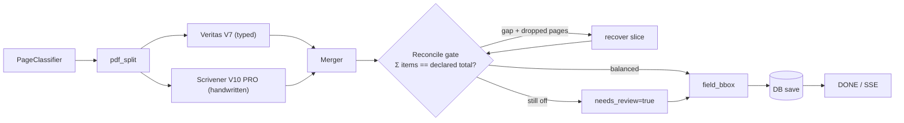

# CLAUDE.md — Project Guide for AI Assistants

## What this project is

**City Agent : PG Release Order** (product name as of v2026.6.14; the repo dir is still `RO-ED-Lang` and internal keys/modules keep their `ro_ed`/`v11` names) is a Myanmar-customs PDF extraction platform. It classifies each page of a customs declaration and routes it to the right specialist (typed pages → **Atlas Swift** / V14-1, handwritten pages → **Atlas Vision** / V14-2; legacy V7 "Veritas" + V10 PRO "Scrivener" kept as fallback), merges results, and presents them in a side-by-side review UI for human approval. The active production pipeline is **Atlas V14** (formerly V11 Maestro) — queue-driven (Redis + RQ), Postgres-backed, with live SSE router events. Built by City AI Team — City Holdings Myanmar. Designed for ~10 concurrent users.

**Usage + audit:** admin **Settings → Usage** (`GET /api/usage/overview`) shows spend / requests / token-volume KPIs, per-user + per-model breakdowns, date-ranged. Login/logout/all runs/actions are captured in `activity_logs` (via `event_logger`) and shown in **Settings → Activity Log** (`/api/activity/*`, admin).

## Tech stack

- **Frontend:** SvelteKit 5 (runes) + TailwindCSS 4.2 + ECharts (cost dashboard) + Vite. **Claude-inspired design system** — warm cream surfaces, clay `#CC785C` accent, Source Serif 4 headings, Inter body, JetBrains Mono code. Tokens in `frontend/src/app.css` (`:root`).
- **Backend:** FastAPI 0.115 + Uvicorn (Python 3.12, 2 workers), Pydantic v2
- **Database:** Postgres 16 (psycopg3 + SQLAlchemy QueuePool 10+10) + Alembic
- **Queue:** RQ + Redis 7 (`worker` container, `replicas: 2`)
- **Reverse proxy:** Nginx 1.27 with HTTPS (TLS 1.2/1.3 + HSTS); self-signed dev / Let's Encrypt prod
- **Auth:** Local JWT (HS256, ≥ 32 chars enforced) + multi-LDAP cascade + Keycloak OIDC (RS256, PKCE)
- **Storage:** S3-compatible (AWS / MinIO / R2 / Wasabi / Backblaze) configurable from `/settings`; local fallback. Secrets Fernet-encrypted in DB.
- **PDF:** PyMuPDF (fitz) at 300 DPI + Pillow. **No Tesseract.**
- **LLMs:** OpenRouter API. V7 typed-page vision + assembler + verifier: Gemini 3 Flash Preview (verifier switched from Sonnet → Flash for cost, see `config.py:71`). Claude Sonnet 4.6 + Opus 4.7 + Gemini Pro used in V7 holistic ensemble (hard docs) and V10 PRO per-stage (master=Opus, reader=Gemini Pro, verifier=Sonnet, filter=Haiku). V11 page classifier: Claude Haiku 4.5.
- **Rate limiting:** slowapi + Redis storage. Login 5/min, extract 10/min, global 1000/hour per IP.
- **Observability:** Sentry SDK (optional, via `SENTRY_DSN`). Integrations: FastAPI, Starlette, AsyncIO, Redis, SQLAlchemy, RQ.

## Pipeline architecture (V11 Maestro)

```
PDF upload (browser)
  → POST /api/extract-v11      (returns 202 + {stream_id})
  → backend/jobs/queue.py      (enqueue RQ on Redis)
  → backend/worker.py          (RQ worker container picks job)
  → backend/v11/workflow.py    Maestro orchestrator:
       1. PageClassifier        → per-page verdict: PRINTED / INKED / EXTRA
       2. pdf_split             → route pages by verdict
       3. PARALLEL:
            ├─ Veritas  (V7  pipeline, backend/pipeline/)   typed pages
            └─ Scrivener (V10 PRO,     backend/v10_pro/)    handwritten pages
       4. Merger                → combine declarations + items
       5. field_bbox            → fitz.search_for() → highlight rects
       6. DB save → DONE
  → SSE /api/extract-v11/stream/{id}?token=<jwt> streams:
       JOB_START, CLASSIFY, ROUTE,
       STAGE_START, STAGE_DONE, STAGE_DETAIL,
       MERGE, RECONCILE, DB_SAVE, DONE, FAIL
       (Redis pubsub channel `v11:events:{job_id}`, history list `v11:history:{job_id}`)
```

**SSE auth:** the stream takes the JWT as `?token=` — the browser client is a native
`EventSource`, which cannot set an `Authorization` header (same pattern as the PDF /
page-image routes in `routes/jobs.py`). Every other extract route uses a normal bearer
header. All of them are behind `Depends(get_current_user)` as of v2026.6.16; the stream
id is additionally bound to its creator in Redis (`v11:owner:{stream_id}`) so one user
cannot poll or stream another's job by guessing a client-supplied id.



**Reconcile gate** (`backend/v11/tools/reconcile.py`, wired in `workflow.py` Phase 4.25 + 4.4): the one invariant every pipeline funnels through — declared `total_customs_value` must equal Σ item customs values. On gap + ATTACHMENT pages, re-extract the dropped slice; if still unbalanced, force `needs_review=true` + `cross_val_passed=0`. Never ship a silent gap. Tunable: `RECONCILE_TOLERANCE_PCT` (5), `RECONCILE_RECOVER` (on).

V7 (legacy sync) is still mounted at `POST /api/extract` for external integrations. V10 PRO standalone at `POST /api/extract-v10-pro` is kept for HW testing. **All UI traffic uses V11.**

## New engines V12–V14 (merged — `main` == `origin/main` == `feature/v13-scribe`)

A new extraction stack — additive, V7/V10/V11 untouched (kept as fallback). Picked per-job via `engine=auto|classic|presto|atlas` on `POST /api/extract-v11`.

**Version scheme — the "Atlas V14" family** (display names; code/module names unchanged):
- **Atlas V14** = `atlas` flagship (unified) — the latest.
  - **V14-1 "Swift"** = Presto (typed sub-engine) — `engine=presto` standalone.
  - **V14-2 "Vision"** = Scribe (handwriting sub-engine).
- **Atlas Classic** = V7 (legacy typed) · **Atlas Heritage** = V10 (legacy ink) — Gen-1, default OFF.
- Shared layers: **Core** = V11 router · **Guard** = gates+JUDGE · **Mend** = self-correct · **Learn** = learn/.
- `engine=` IDs stay `auto|classic|presto|atlas`. Run label `model_used` reads e.g. `Atlas V14 (V14-1 Swift + V14-2 Vision)`.

- **V14-1 "Swift" / Presto** (`backend/v11/presto.py`) — typed fast-path. Digital PDF → `fitz.get_text` text layer → ONE schema call (gemini-3-flash, schema in `v11/presto_schema.py`) → declaration + items. ~20s/$0.01, ~4× faster + ~10× cheaper than V7. Reads typed ∪ attachment pages so misrouted item pages are caught.
- **V14-2 "Vision" / Scribe** (`backend/v13/scribe.py`, `v13/config.py`) — handwriting/scanned (no text layer). High-DPI render → vision vote across N reads. **Model = gemini-3-flash** (NOT gemini-2.5-pro — a reasoning model that truncates mid-JSON → empty). `SCRIBE_MODELS` rotates flash + claude-haiku for cross-model agreement. Verifier-lite re-reads item pages on a sum gap. ~15–75s/$0.01–0.02.
- **Atlas V14** — an engine MODE in `workflow.py` (`engine="atlas"`): typed→V14-1 Swift AND handwritten→V14-2 Vision (`_call_scribe`) + all gates/judge/learn. `atlas.py` facade is a future refactor.

**Math gates** (`v11/tools/reconcile.py`, verdict): item-sum (Σ==total), CIF (**(invoice + freight + insurance + adjustment)×rate ≈ total** → catches wrong rate; tolerance tightens 15%→4% when the freight/insurance/adjustment build-up is supplied), duty (advisory), per-row (value≈qty×price×rate → `bad_rows`). The CIF build-up fields (`freight_value`, `insurance_value`, `adjustment_value`, invoice-currency, signed adjustment) are extracted by V14-1 Swift + V14-2 Vision, stored on `declarations` (migration 0003 + self-heal), editable in review, shown in the declaration report. **Self-correct** (`v11/tools/self_correct.py`): gate fail → re-read only the broken header field (+ few-shot) before any slow fallback. **JUDGE** (`v11/tools/judge.py`): confidence 0..1 → `auto_ok` vs review (`JUDGE_AUTO_THRESHOLD` 0.8). **LEARNER** (`v11/learn/`): priors (importer norms), fewshot (past corrections), weakspots, critic — read-only, advisory, human-approved, inert until data accrues.

**Engine availability** — `GET/PUT /api/settings/engines` (admin). Default unset = **only `atlas` enabled** (legacy off). Agent page renders only enabled engines; Settings → ENGINES tab toggles them. `model_used` reflects the real engine (e.g. "ATLAS V14 (Presto + Scribe)").

**Declaration rescue** (`v11/agents/page_classifier.py` + `workflow.py` Phase 4.3) — in a bundled release-order PDF the classifier can mis-tag the real customs-declaration pages ATTACHMENT ("blank/continuation"), leaving Atlas with an empty result. Two backstops: (1) `_marker_rescue` flips an ATTACHMENT page back to TYPED when its text layer holds ≥2 declaration markers (customs value/duty, assessment, MACCS, CUSDEC, CIF…) — deterministic, no API; classifier thumbnails also raised to 110 DPI; (2) if the merged declaration is still empty, re-run Veritas on the full PDF and adopt its header+items.

**CUSDEC tax/total rescue** (`v11/tools/cusdec_rescue.py` + `workflow.py` Phase 4.35) — same bundled PDFs carry the authoritative MACCS CUSDEC alongside Import-Licence (Appendix 4b) pages; the LLM tends to anchor the header on the licence (no tax block) so duty/CT/AT/SF/MF go null and the total is wrong. `apply_cusdec()` deterministically reads the CUSDEC text layer (detected by tax/release-order markers), extracts CD/CT/AT/SF/MF (numeric line adjacent to each label), `exchange_rate`, `total_customs_value`, and the 12-digit `declaration_no`, and fills them into the declaration (CUSDEC wins — legal source). Pure text-layer, no API, never raises. Paired with a **tax-completeness gate** in `reconcile.py`: a customs total present with ALL of CD/CT/AT/SF/MF null → `taxes_missing=True` and `balanced=False`, so value-balance alone can't mask a dropped tax block.

**App version** — single source `config.APP_VERSION` (CalVer `year.month.patch`) + `APP_ENGINE` + `APP_CHANGELOG`, surfaced in `GET /api/health` and the UI footer (`Atlas V14 · vX`). Bump `APP_VERSION` on each shipped change so a deploy is verifiable at a glance.

**Env knobs:** `PRESTO_ENABLED`, `SCRIBE_MODEL`/`SCRIBE_MODELS`/`SCRIBE_VOTES`, `JUDGE_AUTO_THRESHOLD`, `RECONCILE_{,CIF_,DUTY_,ROW_}TOLERANCE_PCT`.

**Don't** point Scribe at a reasoning model (gemini-2.5-pro/o-series) — it truncates JSON.

**Reconcile runs on TWO key spaces — keep both alive.** Presto/Scribe emit the raw schema
names (`customs_duty`, `commercial_tax`, `advance_income_tax`, `security_fee`,
`maccs_service_fee`); the Phase-4 merge alias map then rewrites them to the DB names
(`import_export_customs_duty`, `commercial_tax_ct`, …). `reconcile()` is called on BOTH —
once inside `_call_typed` / `scribe.run` on the RAW dict, and again in Phase 4.4 on the
merged one. Until v2026.6.16 the tax-completeness gate only knew the DB names, so every
pre-merge call saw `taxes_missing=True` → `balanced=False` → **the Presto fast-path could
never pass its own gate and silently fell back to full V7 on every run** (paying for both),
and every Scribe run fired self-correct + a redundant per-page recovery pass and was
flagged for review. Any new gate must accept both spellings (`_duty_closure` always did).

**`backend/v13/` must be COPYed in the Dockerfile.** `workflow._call_scribe` does
`from v13.scribe import run`. It was missing from the image until v2026.6.16, so the
default `atlas` engine raised `ModuleNotFoundError: No module named 'v13'` in the worker
for any PDF with a handwritten page — while working fine locally (repo on `sys.path`).
If you add a new top-level backend package, add the `COPY` line with it.

## Self-improvement loop (`backend/v11/learn/`, v2026.6.21–6.23)

Human review is fed back into extraction — a closed flywheel, **all flag-gated OFF by
default, fail-safe (degrade to no-op, never raise into the pipeline), human-gated, and
subordinate to the arithmetic gates** (JUDGE hard-interlock `judge.py:203` — a learned hint
can never override reconcile; arithmetic still decides truth). Only `review_status='approved'`
data feeds learning.

- **P1 — few-shot into the PRODUCTION engines** (`LEARN_FEWSHOT_PRIMARY`, +`LEARN_FEWSHOT_SHADOW`
  to log-without-injecting). `fewshot.primary_hint_block()` prepends a **values-free attention
  list** (the fields reviewers correct most, from `field_edits`) to the Presto (`presto.py`) +
  Scribe (`scribe.py`) primary prompt, plus per-importer value hints when the importer is known.
  Before this, only the legacy V7 assembler learned; the Atlas engines had static prompts.
- **P2 — auto-priors on approve** (`LEARN_AUTO_PRIORS`). `routes/review.py` approve →
  `priors.build_priors(importer)` so `check_against_priors` drift-warnings go live (was CLI-only).
- **P3 — adaptive Scribe votes** (`LEARN_ADAPTIVE_VOTES`, cap `SCRIBE_MAX_VOTES`). `scribe.run`
  uses `weakspots.vote_plan` to spend extra cross-model votes on historically-weak fields.
- **P4 — admin-approved prompt rules** (`LEARN_PROMPT_RULES`). `critic.analyze` proposes →
  admin approves via `POST /api/learn/rules` (`rules.py`, stored in `settings.learn_prompt_rules`)
  → injected into the primary prompt. Never auto-applied.
- **P5 — accuracy tracking.** Every human correction (`review.py _apply_edit` + `corrections.py`)
  → `database.bump_field_correction(importer, field)` (corrections-only, no total-skew) → fills
  `field_accuracy` so `weakspots` error-rates become real.
- **P6 — golden corpus from approvals** (`golden.py`, `GET /api/learn/golden/export`). Every
  approved job is a labelled example → reconstructs the (lost) ground-truth corpus from real review.
- **P7 — eval harness** (ALMA-inspired; `evaluate.py`). `score_against_golden(engine)` replays the
  golden corpus through real extraction and scores fields vs approved truth (numeric tol / ISO-date
  prefix / string-norm), **honestly counting skips when a source PDF can't be located** (never faked);
  a scored archive + `promote_if_better()` adopt a change only when it beats baseline. `proposer.py`
  (`LEARN_PROPOSER`, OpenRouter-only) is a bounded LLM meta-agent that proposes ≤5 general rules from
  the accumulated signals — human-approved, never auto-applied.

**Admin API** (`routes/learn.py`, all `require_admin`): `GET /api/learn/{status,proposals,rules,
weakspots,golden/export,evaluate,evaluate/scores,proposals/llm}`, `POST /api/learn/{rules,
priors/rebuild,evaluate/promote}`, `DELETE /api/learn/rules`. `GET /api/learn/status` reports which
flags are on + how much data has accrued.

**Do NOT** let any learn path change an extracted value directly, run without its flag, feed on
unreviewed data, or raise — every function is advisory + fail-safe by contract. **Don't** point the
proposer/any learn LLM call at a non-OpenRouter SDK.

## City Agent ROVER — side extraction engine (`backend/rover/`)

A **separate, self-contained** verified-extraction pipeline for the same customs docs,
independent of Atlas V14. Not on `/api/extract-v11` — it has its own routes
(`backend/routes/rover.py`, mounted in `main.py`) and its own UI (4 left-nav tabs under
`/rover/*`: **Process · History · Items · Declarations**). Postgres-backed
(`ROVER_STORE=pg` → `rover_documents` / `rover_items` / `rover_reports`, header+items+raw
JSONB, approval columns). Human-approval workflow: uploads stay `approved=false` (pending)
until a human approves in the Process tab → moves to History.

**Pipeline (`rover/pipeline_fast.py`):** Tier 0 deterministic text → L1 page-route →
**primary vision read (ONE call)** → deterministic **math supervisor** (the JUDGE — never
an LLM; cross-field invariants + currency bands + decl-no cross-check) → recovery cell-zoom
→ challenger (suspect fields only) → single-pass full-doc rescue → mapping → store →
annotate. Every field is a `Cell{value, source, confidence, model, status, alternates}`.
Fail-closed: any suspect column → `needs_review` (nothing wrong ships unflagged).

**★ Primary reader = native PDF, not page-JPEGs** (`ROVER_PDF_NATIVE=1`,
`ROVER_PRIMARY_MODEL=google/gemini-3.5-flash`). `llm.pdf_content()` sends the raw PDF as a
`{"type":"file","file":{"file_data":"data:application/pdf;base64,…"}}` block — the model
reads the **text layer** directly (no OCR of a downscaled JPEG), ~8k tokens vs many image
tokens. Verified on the 16-doc UAT set: 100% on the 4 hand-checked docs, fixes the
derived-exchange-rate bug, ~4× cheaper. **grok-4.5 is IMAGE-ONLY** — never fed the PDF
block; it stays the challenger on math-flagged fields (`ROVER_CHALLENGER_MODEL=x-ai/grok-4.5`),
reading page-images. `single_agent` uses `max_tokens=8000` (full doc + items or JSON truncates).

**Cost discipline:** the full-doc **rescue** is the big spend and is skipped when
`declaration_no` is the ONLY suspect (an uncorroborated id is a human-confirm, not something
a re-read can fix); `declaration_no` is also dropped from the grok challenger (poor digit
reader). It still gets cheap recovery-zoom + stays flagged for review. Clean docs ≈
$0.015–0.05; scanned/rescue higher.

**Handwriting boost** (`rover/handwriting.py`, `ROVER_HANDWRITING_BOOST=1`) — a mostly-scanned
doc (`is_image_page` majority) with a weak base read (missing items / empty value block) gets
ONE hi-res 300-DPI image re-read under a handwriting-focused prompt; FILLS empties + ADDS
unseen items only, never overwrites. Bounded, flag-gated, fail-safe (MA0259 handwritten docs
recover items but still need human confirm).

**Excel** (`rover/excel.py`, openpyxl): per-doc (Fields + Products) and bulk (Documents +
Products) exports, terracotta header. **Add a column → update `excel.py` writers too.**

**Deploy note:** rover code is hot-cp'd into `ro-ed-api` during iteration; an **env change
needs recreate**, which reverts hot-cp'd files — so bake first: `docker commit ro-ed-api
ro-ed-lang-app:latest` **then** `docker compose -p ro-ed-lang up -d --no-deps app worker`
(app + worker share `ro-ed-lang-app:latest`). Frontend rover pages: `frontend/src/routes/rover/`.
Also add `COPY backend/rover/ /app/rover/` to the Dockerfile (present now) so a full rebuild
keeps rover — it previously survived only through `docker commit`.

### ROVER PRO — the same engine on the Agent page (hybrid)

ROVER is also selectable as an **engine on the Agent page** under the name **ROVER PRO**
(engine id `rover`), alongside ATLAS V14 — while the standalone `/rover` surface stays the
deep-review workbench. Wiring: `routes/settings.py` registers `rover` in `ALL_ENGINES`
(default-enabled `['rover','atlas']`); **`v11/workflow._run_rover()`** is the bridge — an
`engine=='rover'` intercept at the top of `run()` calls `rover.pipeline_fast.run()`, maps the
ROVER `Cell` record → the V11 declaration/items snake_case schema, persists through the same
`_save_to_db`, and emits the same live events, so the Agent page (upload → terminal → results
→ review/approve, History/Items/Declarations) works unchanged. It never falls through to
V7/V10. `model_used = "Rover Pro · Native-PDF"`.

**Gotchas the bridge handles:**
- **ROVER returns numeric strings with thousands separators** (`"1,394,615"`,
  `"111,488.4288"`). Postgres numeric columns are `real` and reject commas — one bad item
  value aborts the whole `save_items` batch (items silently vanish; declaration limps through
  because `save_declarations` coerces). `_run_rover` runs every numeric decl + item field
  through `_num()` (strip commas → float; leave dates/currency/names) before save.
- Terminal banners (`AgentTerminal.svelte`) were hardcoded `[ATLAS V14]` for JOB_START/DONE —
  now label-aware (`pipeLabel(d.label ?? d.pipeline)`, `rover→ROVER PRO`), and the bridge's
  JOB_START/DONE carry `label:"ROVER PRO"`.
- An empty DECLARATION panel after a run is usually a **stale job** created before a mapping
  change deployed — re-run to repopulate.

### ROVER PRO — 16-doc phased UAT (native-PDF, `google/gemini-3-flash-preview`)

Ran the full team test set one-by-one vs the **PD sheet** of `Testing Results(15.7.25).xlsx`
(that sheet = the manual truth ledger; the "AI results" sheet is the OLD 3-Jul run + red
remarks, NOT truth). Totals: **$0.2421** all-in, avg **$0.0151**/doc, median **38s**,
**10/16 money-clean**. Deliverable: `~/Desktop/ro-ed/RO_ROVER_Phased_Report.xlsx`
(Summary + P1–P16, per-doc Declaration 27-col + Items 13-col + 8-field compare + narrative).

Scoreboard (of 7 scored fields): P1–P3 7/7 · **P4 5/7** · P5–P7 6/7 · **P8 1/7** · P9 4/7 ·
**P10 3/5** · P11 5/7 (rate-ok) · P12 6/7 · P13 7/7 · P14 7/7 · P15 5/7 · P16 4/7.

**Proven fixes on real docs:** A invoice de-prefix (P2/P3/P6/P7) · C freight 326,139.86 (P6) ·
D MA slash decl-no `MA0259/100405`,`MA0259/100560` (P15/P16). Native **beats the ledger on
rate** where FC×rate=total reconciles but the ledger value doesn't (P11/P13/P14 — likely
ledger typos).

**Open landmines found (fix order):**
1. **Silent-ship via gameable JUDGE (P10, worst)** — model fabricated Adjustment 44,612.82 so
   `(FC+adj)×rate` closed the CIF identity → `suspect=[]` → wrong total shipped (truth = FC×rate).
   Math JUDGE is beatable by self-consistent hallucination. **Need a build-up/silent-ship guard.**
2. **Trim under-selects on big multi-invoice docs** — harness keeps only pages with ≥2 text
   markers; P8 kept 5/28, P9 kept 1/13, dropping money/invoice pages → header-from-items
   fallback (P8) + hallucinated rate 2100 (P9). Need retain-key-page + header/AT/rate fallbacks.
3. **CIF false-flag on uplift-heavy docs (P3/P7/P16)** — rate+total both correct yet marked
   suspect → needless escalation cost (3×). Need a build-up/tolerance gate.
4. **Commercial-invoice vs CUSDEC-ref (P4/P16)** — model returns the form's `A-/AM-` reference,
   ledger keys on the exporter commercial number (`EX25003MM`, `PD001`). Need a bridge.
5. **AT 2% unread (P15/P16)** — AT=0 vs ledger = exactly 2%×total on both. Deterministic
   fallback `AT = 2%×total when blank` recovers to the cent.
6. **Text-less scans (P4)** — no text layer → whole-doc vision (slow), empty product line,
   invoice/date degrade. Need OCR-first / image-marker page targeting.

**Batch-date semantics (confirm with team):** the ledger "date" is a shared registration/batch
date, not the per-doc form date — P10/P11/P12 (different docs) all ledger-dated 2025-10-09 while
their printed declaration dates differ; direction (team earlier/later) varies. Not on the CUSDEC
form. **Recommendation:** keep native-PDF + `gemini-3-flash-preview`, but do NOT auto-ship until
the silent-ship guard (#1) lands; pre-trim/split large PDFs.

## ROSETTA — engine id `rosetta` (2026-07-30)

Same native-PDF reader as ROVER PRO, plus two things: it **re-reads a document that comes
back obviously incomplete**, and it **pins its own model** instead of inheriting a shared
env var. ROVER PRO is unchanged and sits beside it so the two can be compared.

`v11/workflow.py`: `ROSETTA_MODEL` (default `google/gemini-3.6-flash`), an `engine=='rosetta'`
intercept calling `_run_rover(..., retry_on_empty=True, label="ROSETTA", model=ROSETTA_MODEL)`,
plus `_looks_incomplete()` and `_run_with_retry()`. `model_used = "Rosetta · Native-PDF"`.

**Why it exists — measured, not assumed.** The same 28-page bundle (100306922661), same
model, same code, three runs: header wrong + 0 items ($0.3303); everything correct + 7 items
($0.1731); header correct + **0 items** ($0.2050). Header 2/3, items 1/3. Nothing noticed,
because a missing item list is not an arithmetic error — there is no sum to fail when there
are no rows. The bad run also cost **twice** the good one, because the failure triggered
rescue/recovery passes.

The guard is deliberately narrow — only outcomes that cannot be right:
- declared total + **zero** product rows → re-read
- product rows + no total → re-read
- neither → left alone (a doc with no items has no total; retrying buys the same empty answer)
- total of `0` → not "present" (0 is what the old code wrote when it read nothing)

**One retry, never a loop.** Second read no better → first stands, `needs_review=True`.
Retry crashes → first read kept. A retry must never make the outcome worse than not retrying.

**Scope limit, verified:** the guard catches an EMPTY item list, not a WRONG one. Three
ROSETTA runs all scored 5/5 on header fields, but one produced item rows with `quantity=1`
and `unit_price=24,021,813.4` (truth: 2400 @ 129.521). Item VALUES are still
non-deterministic. The next guard needs the form's own `Total items` / `Total item value`,
which are printed on the page and not currently extracted.

**★★★ A new engine touches SEVEN places** — six in code, one in the database:
`routes/settings.py` `ALL_ENGINES` + `_DEFAULT_ENABLED` · `v11/workflow.py` model constant +
`run()` intercept · `agent/+page.svelte` type union + `ENGINE_OPTIONS` + `enabledEngines` ·
`AgentTerminal.svelte` `PIPELINE_LABEL` + the single-pass check that hides CLASSIFY/ROUTE ·
**and `settings.engines_enabled` in the DB, which OVERRIDES `_DEFAULT_ENABLED`.** That row
held `["rover","atlas"]`, so ROSETTA was invisible in the UI no matter how correct the code
was. Same trap as `engine_default`, which is why ATLAS stayed selected until it was updated.

## ★★★ `invoice_price` changed UNIT — the regression that cost 10 fields

When ROVER PRO was bridged in, `v11/workflow.py` mapped
`"invoice_price": _num(vals.get("invoice_price_mmk"))`. That **redefined an existing column's
meaning**. `invoice_price` had always been the INVOICE-CURRENCY amount — the team's ledger THB
column, both Excel writers, and the signed Beta v3 requirement form (§3 *"Values are read in
the invoice currency (not MMK)"*) all read it that way.

Scored against the manual PD ledger: **3 Jul run 54/60. Pre-fix today 44/60.** Invoice price
alone fell **12/13 → 1/13**. After the fix and a re-extract of all 20 documents: **59/60, zero
regressions.**

**Why three safety nets missed it:** (1) no test asserted the column's UNIT — nothing crashed,
a float column got a valid float; (2) **the CIF gate reads `invoice_price_fc` FIRST**, so the
arithmetic still closed and documents shipped `suspect=[]` — the one guard that could have
caught a wrong invoice was reading the *other* column; (3) nothing compares to the ledger
automatically. Same shape as the freight/insurance/adjustment NULLs and the mixed date
formats: **the engine→DB bridge is hand-written field-by-field with no schema contract.**

Fix: `invoice_price_fields(vals, coerce)` in `v11/workflow.py` (extracted so a test calls the
REAL mapping — the first version of that test copied it and would have passed regardless),
plus a new `invoice_price_mmk` column so the kyat figure has its own home.

## Shared parsers — `numeric.py` and `dates.py`

Ten near-copies of `_num()` (nine of them `float(str(v).replace(",", ""))`) silently dropped
any amount printed with its currency: `"THB 652,279.7184"` → None. **`backend/numeric.py`** is
now the single parser. It does NOT strip every non-digit — that turns `2026/01/08` into
20260108 and `MA0259/100405` into a number. Currency list is EXPLICIT, not `[A-Za-z]{1,4}`:
replaying 231 stored values through the loose pattern turned the invoice reference
`"A- 9518633846"` into a float.

**`backend/dates.py`** — the four date columns are TEXT and held `2025-06-25`, `2024/04/01`
and `12/10/2025` at once. Day-first vs year-first is settled by the documents: the same bundle
prints `27/09/2029` and `19/10/2025`, whose leading groups cannot be months. Wired into
`save_declarations` (every engine) and `coerce_for_column` (reviewer edits).

**`_pick()` in `_save_to_db`** replaced `a or b` on every money row. `or` cannot tell **zero**
from **absent**: Commercial Tax is genuinely 0 on many declarations and was being stored NULL,
and on the release order **`Adjustment` is the small CODE integer (2)** printed beside
`Adjustment value` — a blank adjustment picked up the code as money AND tightened the CIF
tolerance as though a build-up existed.

## Excel export = the team's own layout

The per-job and bulk writers now emit **exactly** the team's workbook: Declaration **23
columns**, Product Items **13 columns**, their names and order. Verified by generating a real
export and diffing headers against the file they supplied. `Release Order Date`, `Arrival
Date`, `Completion Date`, `Invoice Price (FC)` and `Invoice Price (MMK)` are deliberately NOT
in the sheet — still extracted, stored, editable and used by the gates.
`tests/test_export_columns.py` pins the layout and asserts every listed column is actually
populated. `routes/data.py` used the name `all_cols` for BOTH sheets; renamed.

## ★★ SSE: the terminal listened on the wrong channel

`agent/+page.svelte` set `streamingJobId` to a **client-generated** `preAllocId` before
submitting, read the server's `stream_id` into a local, and never updated what it listened to.
The worker publishes to the server's id. Redis showed both key shapes side by side
(`v11:history:v11-fd698d79c3ff` and `v11:history:b9875677-…`). `AgentTerminal` renders SSE
lines only `{#if jobId}` and otherwise falls back to the legacy `lines` prop — that fallback
is the idle `cityagent cli ready` banner users saw while a job was running.

**Refresh dropped the stream too.** The restore path said *"V11 SSE handles live status;
nothing to poll on restore"* — but nothing reopened it. The job kept running server-side; only
the UI stopped following it. Now `streamId` is persisted per queue entry and
`resumeInterruptedJob()` reopens the stream on mount. **The SSE endpoint replays history from
Redis** (verified: 200, 2373 bytes for a finished job), so the whole log comes back.

## UI revamp — `DESIGN.md` (2026-07-30)

`DESIGN.md` in the project root is the design system, derived by **measuring** the sibling
CityAgent Insights codebase (`CityAgentWork/bagofwords`, 345 components) rather than by taste:
`text-xs` 1,952× (body is **12px**), `font-medium` 1,177× vs `font-normal` 30× (**500 is the
default weight**), `border-gray-200` 619× vs `shadow-*` 144× (**hairlines, not shadows**),
`dark:` **7,969×** (dark mode is first-class), 2,183 `hover:` and 867 focus rules.

Landing now: `app.css` on the **Tailwind gray + blue-600** palette with three-way dark mode
and `html { font-size: 12px }`; `AppSidebar.svelte` replacing `TopNav.svelte` (224/56px,
collapse persisted, mobile drawer); search + **date range** + filters + chips + live count on
history / declarations / items. Declarations lets you choose WHICH date the range applies to.
★ The date filter must NEVER drop a row it cannot parse — `inDateRange` returns true on an
unparseable value.

## Active extract endpoints

```
POST /api/extract                          V7 sync (legacy / external)      auth: bearer
POST /api/extract-v10-pro                  V10 PRO standalone (HW testing)  auth: bearer
POST /api/extract-v11                      V11 Maestro queue → 202  ← MAIN  auth: bearer
GET  /api/extract-v11/status/{stream_id}   Poll RQ status                   auth: bearer + owner
GET  /api/extract-v11/stream/{stream_id}   SSE Redis pubsub                 auth: ?token= + owner
```

All five require authentication (v2026.6.16 — they were open before). "owner" = the
stream id is bound to its creator; a user with `data_scope` `own` gets 403 on someone
else's stream.

## Review API (`backend/routes/review.py`, 15 endpoints)

```
GET    /api/review/queue                          filter list (status, importer, date)
GET    /api/review/stats                          counts per status
GET    /api/review/{job_id}                       full job + items + edits
PATCH  /api/review/{job_id}/declaration           inline cell edit
PATCH  /api/review/{job_id}/items/{item_index}    inline cell edit
POST   /api/review/{job_id}/approve
POST   /api/review/{job_id}/reject
POST   /api/review/{job_id}/draft
POST   /api/review/bulk/approve                   body: {job_ids: [...]}
POST   /api/review/bulk/reject                    body: {job_ids: [...]}
GET    /api/review/{job_id}/edits                 audit trail
POST   /api/review/{job_id}/items                 add row
DELETE /api/review/{job_id}/items/{item_index}    soft-delete row
POST   /api/review/{job_id}/items/reorder         body: {order: [...]}
POST   /api/review/{job_id}/rerun                 re-extract; links via parent_job_id
```

Every cell change writes a row in `field_edits` (job_id, field_path, old, new, user, ts).

### Issues layer (plain-English, 2026-07-18)

`backend/issues.py` `build_issues(job, decl, items)` derives a machine-readable list of
everything wrong/missing on a job — `{code, title, severity, field, detail, cause, fix}` —
written in PLAIN ENGLISH for non-technical reviewers (no Σ, no CUSDEC/attachment/cross-val
jargon in user-facing strings; titles like "Products do not add up to the total").
Computed at READ time from stored declarations/items → works for all past jobs and every
engine, no migration. Checks: item-sum gap >5%, no items, no declared total, all-5-taxes
missing, 9 key header fields empty (each with its usual real-world cause), items missing
HS/price/qty, cross-val failed, accuracy <90.

Wired into: `GET /api/review/{job_id}` (`issues` key, fail-safe wrapper — never breaks the
payload) → ReviewSplitView "⚠ CHECK THESE" collapsible panel above DECLARATION; and the
per-job Excel (`routes/jobs.py download_job_excel`) as the FIRST sheet "Issues" (Type =
MUST FIX / LOOK AT / FYI · Problem · What happened · Why · What to do) — users complain
from the Excel file, so the explanation ships inside it. Gotchas: the declarations column
is `invoice_number` (NOT `invoice_no`); add new issue checks to `issues.py` only — both
consumers pick them up automatically.

### Lifecycle dates (team feedback 2026-07-18)

Each customs PDF carries up to SIX dates. The team's ledger keys on the **Release-Order
date** (their sheet column "RO/ID Date"), not the Declaration date — the cause of every
"wrong date" complaint in Testing Results(15.7.25).xlsx. Four dates are now first-class
columns on `declarations`: `declaration_date`, `arrival_date`, `release_order_date`,
`completion_date` (TEXT; self-heal ALTERs in `database.py`). Flow: ROVER
`schema.COLUMNS` + `single_agent` prompt + `deterministic._labeled_date` readers →
`v11/workflow._run_rover` decl mapping → `_save_to_db` whitelist → `save_declarations`
INSERT → ReviewSplitView `declRows` → Excel `download_job_excel`. Add a new decl field =
touch ALL of those; miss one and it silently drops.

**The three lifecycle dates are DETERMINISTIC-ONLY since 2026-08-04.** `arrival_date`,
`release_order_date` and `completion_date` were removed from the Presto (`v11/presto.py`)
and Scribe (`v13/scribe.py`) prompts — ~212 tokens/call, which was never the point. The
point: they are printed at fixed labels, so `v11/textlayer_header.py` and `v11/formread.py`
read them for FREE and exactly, while on a scanned page — where no reader can run and
there is nothing to check an answer against — the model filled the blank row by **echoing a
neighbouring date**. `rover/supervisor.flag_echoed_dates` documents two real documents
carrying an arrival date and a release-order date printed nowhere in the file, both equal
to that document's declaration date. **A date has no arithmetic to fail, so no gate catches
it.** Blank is now the answer on a scan: a reviewer can see a blank, they cannot see an echo.
Columns, `DECLARATION_FIELD_MAP`, the review screen and the `/declarations` date filter are
all unchanged — the team still keys on RO/ID Date. `arrival_date` in
`v11/tools/vision_rescue.py` is the deliberate EXEMPTION (asserted by a test): it is the
only reader that can overrule an arrival date the typed lane scraped off a waybill
attachment, which is why `workflow.py` lists it as authoritative from that source.
Pinned by `tests/test_lifecycle_dates_deterministic.py`.

**★★★ `_save_to_db` whitelist LANDMINE** (`v11/workflow.py`): `db_decl` is a hard
whitelist — any field an engine extracts but this dict doesn't map is SILENTLY dropped
before the DB. This is why freight/insurance/adjustment were NULL for every job ever
(now mapped through; extraction itself still pending) and why the new date columns read
NULL until added here. Check this FIRST when a field extracts fine in `pipeline_fast`
but lands empty in the DB.

**Deterministic date readers** (`rover/deterministic.py`): `_labeled_date` tries EVERY
occurrence of a label (a blank "Arrival Date :" exists on the port delivery-order page
before the filled CUSDEC one) and excludes false labels — "Release order" must skip the
"Release order notification" page TITLE. On digital docs these $0 readers beat vision.

**PDF download filename** — `serve_pdf` (`routes/jobs.py /{job_id}/pdf`) sets
`Content-Disposition: inline; filename="<decl_no>_<job_id>.pdf"` so a saved PDF is
traceable to both the customs doc and the job. ReviewSplitView loads the viewer iframe
from the DIRECT token URL, not a blob — a blob-URL download loses the server filename.
Keep it that way.

## Auth

- **Local** — bcrypt password hash, HS256 JWT. Signing secret resolved by `auth._resolve_secret()`: `JWT_SECRET_KEY` env (≥32 chars, preferred for prod/rotation) → else **auto-generated + persisted** in the `settings` table (`database.get_or_create_jwt_secret`, atomic `ON CONFLICT`, shared by every app/worker process + restart) → else dev fallback only if `DEV_MODE=1` and DB unreachable. So a fresh deploy is secure-by-default without setting the env var.
- **LDAP** — multi-config cascade in `backend/ldap_auth.py`. Configs in `ldap_configs` table (Fernet-encrypted bind passwords via `ldap_crypto.py`). On successful bind: user upserted with `auth_source=ldap`, `default_ldap_id=N` for next-time fast path.
- **Keycloak** — OIDC RS256 + PKCE. Config from `KEYCLOAK_*` env vars *or* the Settings UI (`settings` table). `/api/auth/config` exposes discovery to frontend. `/api/auth/token` exchanges code; `/api/auth/refresh` refreshes.
- **Force-change-password** — flag set on first admin boot when password was randomly generated. Frontend redirects to `/change-password` until cleared.

## Storage (factory pattern)

`backend/storage/__init__.py` returns either `S3Storage` or `LocalStorage` based on the active `storage_config` row. Switching is live (no restart): writes go to whichever config is currently `active=1`. Reads first try the recorded `pdf_storage` for that job, then fall back to local. Secrets Fernet-encrypted with `STORAGE_FERNET_KEY`.

## File structure (verified)

```
backend/
  main.py                  FastAPI app, 3 extract endpoints, lifespan, auto-approve cron, Sentry init
  worker.py                RQ worker entrypoint (separate container, replicas=2)
  auth.py                  JWT + bcrypt + OIDC verification
  ldap_auth.py             multi-LDAP cascade login
  ldap_crypto.py           Fernet wrapper for bind passwords
  database.py              Postgres-backed sqlite-compat shim (legacy callers)
  db_engine.py             SQLAlchemy QueuePool, dict-row factory, ?→%s translator
  schemas.py               Pydantic models (incl. tokens_in/out, model_used, review fields)
  config.py                env loading + validation (≥32 char JWT, fernet keys)
  middleware.py            request logging, CORS, Sentry hooks
  rate_limit.py            slowapi limiter (Redis-backed)
  event_logger.py          activity_logs writer (9-field enrichment)
  cost_tracker.py          token + USD accounting
  alembic/versions/        DB migrations (0001_initial_schema.py = full schema)
  routes/                  auth, jobs, users, groups, data, settings, corrections,
                           usage, ldap, activity, storage, review, learn
  v11/learn/               self-improvement layer: priors, fewshot, weakspots,
                           critic, rules, golden, evaluate, proposer (all advisory,
                           flag-gated, fail-safe — see "Self-improvement loop" above)
  jobs/queue.py            RQ + Redis singletons
  jobs/tasks.py            run_v11_task (background entry)
  v11/workflow.py          Maestro orchestrator
  v11/event_bus.py         Redis pub/sub publisher
  v11/agents/              page_classifier.py, merger.py
  v11/tools/               pdf_split.py, field_bbox.py
  v10_pro/                 Scrivener — workflow.py, agents/, tools/, schemas, knowledge
  pipeline/                V7 / Veritas — pipeline.py, splitter.py, vision.py,
                           assembler.py, verifier.py, vision_arbiter.py,
                           consensus_resolver.py, holistic_voter.py, solo_extractor.py,
                           cell_zoom.py
  pipeline/confidence.py   multi-signal confidence scoring (shared by V7/V10/V11)
  storage/                 local.py, s3.py (factory in __init__.py)
  scripts/migrate_sqlite_to_pg.py

frontend/src/
  routes/                  agent, login, change-password, review, history,
                           declarations, items, costs, users, settings
  lib/api.ts, components/, stores/, utils/, colors.ts, pipelineConfig.ts
  app.css                  design tokens + cl-* component layer (see UI shell below)
frontend/static/
  cityagent-logo-web.png   trimmed brand lockup (login + sidebar)
  cityagent-mark.png       square emblem (favicon / compact use)

UI shell (2026-07-18 overhaul — top nav + merged CLI agent page):
  - `lib/components/TopNav.svelte` — horizontal top bar (Agent / History / Review /
    Items / Declarations / Costs / Settings, `auth.canPage`-filtered, sticky,
    terracotta active underline). REPLACES `Sidebar.svelte` (file kept, unused).
    The ROVER nav group was deleted — `/rover/*` pages stay reachable by URL only.
    `Footer.svelte` is full-width (no 236px offset).
  - `routes/agent/+page.svelte` — ONE merged page (old empty/loaded split deleted):
    LEFT = light "paper terminal" (`rv-*` scoped styles): engine cards `[1]/[2]`,
    slim DROP line, QUEUE table (duplicate expands INLINE with view/re-run/confirm),
    EXECUTE / STOP & CLEAR / CLEAR, BATCH one-liner, RECENT_JOBS (api.listJobs(6)).
    RIGHT = CLI only (`AgentTerminal` with `light` prop, idle ready-banner via
    `cliLines`); NO PDF pane — review opens full-width once the job is done.
    `stopAndClear()` also appears for a stale `processing` entry restored from
    localStorage after a reload (kills it + wipes the queue).
  - `AgentTerminal.svelte` light mode = `.atl-flip { filter: invert(0.93)
    hue-rotate(180deg); }` on title bar + body — the dark console's hardcoded
    hexes flip to a light palette without touching them. `defaultHeight` prop +
    SIZE button cycles 520/220/40.
  - Typography is unified to the terminal grammar: `html { font-size: 15px }`
    (global rem scale), `.cl-hd` + `.dark-bar` = JetBrains Mono 11px UPPERCASE
    (NOT serif), `.cl-ph h1` 18px mono, `.cl-stat .n` mono 19px, KpiCard values
    mono (+ `compact` prop). Don't reintroduce serif panel headers.
  - FE deploy into the running container: `docker exec -u root ro-ed-api rm -rf
    /app/frontend-build/_app` (non-root can't delete) → `docker cp frontend/build/.
    ro-ed-api:/app/frontend-build/` → bake (`docker commit`) → `compose up -d
    --no-deps app worker`. Skip the rm and stale hashed bundles accumulate.
  - `lib/components/ReviewSplitView.svelte` — split reviewer. All cell/border/
    status colors use theme tokens (`--info` edited, `--warning` empty/flag,
    `--success` ok, `--error`/`--outline-variant` reject) — no raw hex. Every
    save/PDF/approve catch surfaces a toast; `beforeunload` guard on unsaved
    edits; PDF blob-fetch failure shows a fallback banner; Tab walks declaration
    cells; deleted rows get an 8-second Undo chip.
  - `app.css` `cl-*` layer — reusable primitives every page uses: `cl-panel` /
    `cl-hd` / `cl-bd`, `cl-ph`, `cl-stat`, `pill` (ok/warn/err/info/plum/clay/
    muted), `cl-lbl` / `cl-inp`, `cl-btn(.primary/.sm)`, `cl-table`, `seg`,
    `cl-toggle`, `cl-drop`, `cl-bar`. Soft `--line` borders, no black outlines.
  - `routes/login/+page.svelte` — branded two-column responsive login (clamp-
    sized, single-col < 980px); right panel is a synced, animated CityAgent
    preview (illustrative only, not interactive).

nginx/
  conf.d/                  HTTP redirect + HTTPS server blocks (SSE buffering off)
  ssl/                     fullchain.pem, privkey.pem
  logs/                    persisted access + error logs

scripts/
  generate_dev_cert.sh     self-signed TLS for local dev
  pg_backup_loop.sh        daily cron entrypoint for pg-backup container
  pg_backup_now.sh         manual one-shot backup
  pg_restore.sh            restore from <file>.sql.gz
```

## Storage types + JSONB — migration `0007` (2026-08-01)

**Alembic owns the DDL. Editing a `CREATE TABLE` in `database.py` changes nothing.** Tables
are created by `0001_initial_schema`; the boot self-heal only `ADD COLUMN IF NOT EXISTS` —
it never ALTERs an existing type. A column type is changed by a migration or not at all.
This was proven the hard way: a "fix" to `importer_profiles.exchange_rate_*` in
`database.py` was reviewed, looked correct, and was completely inert.

**`0007_storage_types`** — `real` columns 11 → 4, `jsonb` 0 → 12, adds `jobs.raw_extraction`.
Money is `numeric(20,4)`; rates and unit prices `numeric(24,10)` (a real ledger rate is
`61.95007144978846` — `real` stored `61.95007`); quantity `numeric(24,6)`; `jobs.cost_usd`
`numeric(20,8)` because per-call spend drops below $0.0001. `items.{quantity,
invoice_unit_price, cif_unit_price, exchange_rate}` were **`text`**. Deliberately left `real`:
`jobs.accuracy_percent`, `jobs.processing_time_seconds`, `processing_logs.duration_seconds`,
`page_extractions.confidence` — telemetry that never multiplies into money. But
`items.customs_duty_rate` / `commercial_tax_percent` ARE converted: percentages that are
inputs to a monetary product.

**★★★ Every migration must guard its ALTERs against a missing column.**
`0006` altered `invoice_price_fc`, a column **no migration creates** — it exists only via the
`database.py` self-heal, which runs AFTER alembic. Transactional DDL meant 0006 throwing
rolled back all six migrations: zero tables, no `alembic_version`, uvicorn crash-looping
forever. **A first-time deploy could not boot**, and no existing database showed it. Both
0006 and 0007 now use a `_present_cols()` helper — one `information_schema` query filtered
by `table_schema = current_schema()`.

**★★★ Converting `text` → `jsonb` breaks two caller patterns, one of them silently.**
1. `json.loads(row["x_json"])` — psycopg3 returns jsonb already parsed, so this raises
   `TypeError: ... not dict`. Six sites; two sat inside `except Exception: continue`, so the
   **checks page rendered empty with no error anywhere**. Use `jsonio.loads_maybe()`, which
   accepts dict / list / str / bytes / None and works either side of the migration.
2. `WHERE evidence_json <> ''` — fine on text, a **hard Postgres error** on jsonb
   (`invalid input syntax for type json`). Use `<> '{}'::jsonb`.

**All jsonb callers CLOSED 2026-08-04** — `tests/test_jsonb_callers.py` was a strict
`xfail` over 8 open sites; the last two are fixed and the marker is gone, so the file is now
a live guard that fails when a NEW unguarded parse appears. Both survivors were fixed with
`jsonio.loads_maybe`. **Neither matched its own pinned description**, which is worth
remembering because the fix order was chosen from those descriptions:

- `routes/data.py` (`GET /api/data/ai-tables`) — SILENT as documented. Its `except`
  absorbed the TypeError *per row* inside the aggregation loop, so once every row failed
  identically the endpoint answered **200 with an empty table list**, not one job missing.
- `database.py get_page_extractions` — pinned as the worst SILENT site, "nothing raised
  anywhere". **Wrong: it crashed.** `json.loads(row.pop(jf))` popped BEFORE parsing, so the
  TypeError left the key already gone and the handler's own `del row[jf]` raised `KeyError`,
  which `except (JSONDecodeError, TypeError, ValueError)` does not catch.

The blind-spot test that guarded it was **vacuous**: it grepped a 600-char window for
`"TypeError"` and `"= {}"`, which the replacement's own explanatory COMMENT satisfied. It
went green while asserting nothing. Now walks the AST — asserts `loads_maybe` present, no
raw `json.loads`, no `Try`, no `Delete` in that loop. **A guard that greps source text for
a string can be satisfied by a comment.**

**★★★ A `numeric` column rejects `''`, and one bad row kills the whole batch.**
`save_items` used `_g(..., default='')`. Against `text` that was harmless; against `numeric`
it raises `invalid input syntax for type numeric: ""`, the `executemany` aborts, **every item
is lost and the job still reports success**. All 7 save sites now coerce through
`numeric.to_float`. That parser is deliberately conservative — it refuses `MA0259/100405` and
`2026/01/08` rather than mangling an ID or a date — so quantity needs a narrow fallback for
the unit-suffixed shape (`'383000 U'`) that appears in the team's own export.

**Absent is NULL, never `0.0`.** `database.py` defaulted the item customs value to `0.0`,
which made "could not read" indistinguishable from "the form says zero" and had the item-sum
gate report a 100% shortfall on a document where nothing was missing.

**`backend/fields.py`** — a 50-field registry (name / meaning / **unit** / type / nullable /
export header / aliases) with `validate()`. It is INERT: nothing consumes it yet. It already
documents 27 live type contradictions and **6 orphan fields that are extracted and then
silently discarded** — `declaration_no_official`, `importer_code`, `customs_value_usd`,
`items[].value`, `items[].unit`, `items[].no`.

## Reading the item block — the prompt was written against the wrong form

`rover/single_agent.py` asked for `13.No / 14.Hscode / 15.Description / 18.Quantity /
19.Value`. Those are **Import Licence (Appendix 4b)** field numbers, and `19.Value` is
invoice-currency by definition — so `customs_value_mmk` held THB, ~58x wrong, in a column the
customer's spreadsheet labels MMK. The CUSDEC item block is what to read: `No. 001  HS <code>`
then `Item name`, `Quantity (1)`, `Item value`, `Invoice unit price`, `Customs value`.
`value` <- Item value (invoice currency), `customs_value` <- Customs value (assessed MMK).
Never derive one from the other: the assessed value may carry an uplift.

**★★ There are TWO product lanes.** `single_agent.run()` returns items, and `products.run()`
returns items, and `pipeline_fast.py` does `items = prod.get("items") or routed_items` — so
**`products.py` wins**. Fixing only `single_agent.py` changes nothing; the first attempt at
this fix produced `0.0` on every row for exactly that reason. Any item-schema change must
land in BOTH prompts.

**Excel is exactly two sheets** — `Product Items` (13 cols) then `Declaration` (23 cols),
matching the workbook the team supplied. The `Issues` sheet was removed on request; the
issues themselves still surface in the review UI via `GET /api/review/{job_id}`.

## ★★★ Document identity — a bundle holds a LICENCE beside the declaration (2026-08-04)

`0259100560` stored **19 product rows for a four-item declaration**. Seven were Belgian
chocolate that is not in the shipment. The bundle is 12 pages: CUSDEC on 3-4, **Import
Licence (Appendix 4b) on 6-8**, invoice/packing list on 9-10 — and **every page is a
photograph, 0 extractable characters**, so `triage._locate_cusdec_page` (which searches
`get_text()` for markers) found no CUSDEC anchor at all.

A licence carries its OWN goods table: same HS codes, same product names, licence
quantities, and its own `Total CIF Value (Kyats)`. It lists everything the importer is
PERMITTED to import — here 11 lines against the shipment's 4, and 3,303 KG of one item
where the CUSDEC declares 3,168. **Both documents are correct.** This can never be fixed by
picking the "better" read.

**The duplication was the visible problem, not the dangerous one.** The licence's 11 lines
sum to 95,707,004.71 against the licence total of 95,707,461.09 the header had ALSO taken —
a 456-kyat gap, 0.0005%, inside any tolerance. Fix the dedup alone and the job ships eleven
tidy rows reconciling to the penny off the wrong paper, `suspect=[]`. Same shape as the P10
silent-ship landmine: arithmetic closing on self-consistent wrong inputs.

**Root cause: the classifier knew and threw it away.** Its `reason` string said *"CUSDEC-1
Customs Import Declaration form"* for p3 and *"Myanmar Import Licence"* for p6 — free text,
truncated to 80 chars, display only. The only STRUCTURED answer was TYPED / HANDWRITTEN /
ATTACHMENT, which describes how a page is FILLED IN. A licence is machine-printed, so TYPED
is honest — and "typed" then stood in for "authoritative" all the way to
`v7_typed_priority`, which handed a licence the header and the item list.

Four parts, and **the order they were applied in is load-bearing**:

1. **`page_classifier`** now returns `document` — `DECLARATION | LICENCE | INVOICE |
   PACKING_LIST | OTHER | UNKNOWN` — as a second, independent axis. The prompt states the
   trap explicitly and that a **continuation sheet IS the declaration** (it carries the item
   rows). `_document_rescue` settles it free from printed title blocks where text exists.
   **The licence markers are TITLE-BLOCK phrases, never customs vocabulary** — a licence
   prints an HS column, a goods table and `Total CIF Value`, so the older `_DECL_MARKERS`
   (which contains `"cif value"`) identifies the WRONG document with full confidence.
2. **`workflow._scope_items`** (Phase 3.95): a lane whose pages are positively LICENCE /
   INVOICE / PACKING_LIST and which touched no DECLARATION page **contributes no items**,
   and if it is the typed lane it loses `_OFF_DECLARATION_HEADER` too. This overrides
   Phase 3.9's deliberate *"the typed lane keeps its ITEMS"* — right for misrouted
   continuation sheets, wrong for a licence.
3. **`reconcile._document_check`** folds `doc_ok` into `balanced`. Every other clause is a
   sum, and a licence defeats all four at once because it is internally consistent. **This
   is the only clause that asks WHICH PAPER.**
4. **`merger._dedup_match`** last: `_norm_name` strips punctuation + collapses whitespace,
   plus a `SequenceMatcher >= 0.94` near-match **only when HS, pack or quantity was present
   AND agreed** (FLAVORED vs FLAVOURED; a -OUR/-OR dictionary is unsafe — FLOUR → FLOR).

**Fail-safes, all pinned by tests:** `UNKNOWN`/`OTHER` are never proof (absence of evidence
must not delete rows); scoping **never empties a job** — a foreign lane that is the only
item source is KEPT + `needs_review` (a reviewer can delete a wrong row, not recover a
dropped one); no DECLARATION page identified → legacy behaviour; untagged items make
`_document_check` return `doc_checked=False` so no pre-existing job's verdict changes.
`_src_doc` is stamped BEFORE any dropping and before the no-anchor bail-out — stamping only
on the drop path leaves the gate blind exactly where it is needed. `save_items` reads
columns by explicit name, so `_src_doc` never reaches the DB.

**VERIFIED on the real document 2026-08-04:** 19 → **4 items**, quantities 3312 / 5676 /
**3168** / 5664 matching the CUSDEC (not the licence's 3303), chocolate gone, item sum
105,506,056 = the total handwritten in the CUSDEC's own box. Cost **$0.2578 → $0.0849** —
dropping the wrong lane removed the work it caused.

**STILL BROKEN on that document:** `total_customs_value` stored **942,418,932**. The form
prints `CIF- 942,418.9320` (THB) in field 29 — wrong field AND a lost decimal. Correct
total is 105,506,056, which the items already sum to. `cross_val_passed=0`, correctly
flagged. Unrelated to the four phases above; it is the vision rescue reading the header.
Also: stored `sanity_flags` still quote `decl=95707461` from a reconcile pass that runs
BEFORE scoping — stale and confusing in the review UI.

**Not caught:** a licence the classifier labels DECLARATION. Its rows are stamped
DECLARATION and the gate agrees. On an all-photograph bundle the deterministic title check
cannot run, so the model's label is the only defence.

## DB schema

20 tables (full DDL in `backend/alembic/versions/0001_initial_schema.py`). Key ones:

- `jobs` — job_id (PK), pdf_name, pdf_hash, pdf_storage, status, pipeline_version, pipeline_mode, document_type, review_status (`pending_review` / `approved` / `rejected` / `draft`), reviewed_by, edits_count, parent_job_id, field_bboxes_json, tokens_in, tokens_out, cost_usd, accuracy_percent
- `declarations` — one per job, all customs header fields + invoice_price, exchange_rate, total_customs_value, taxes (CT / AT / SF / MF), sanity_flags_json, cross_val_passed, verified
- `items` — line items (item_name, hs_code, quantity, prices, customs_value_mmk), `is_deleted` for soft-delete, `display_order` for reorder
- `field_edits` — per-cell audit (job_id, field_path, old_value, new_value, user, created_at)
- `users` — local + LDAP + Keycloak unified; `auth_source`, `default_ldap_id`, `ldap_dn`, `keycloak_id`
- `groups` + `user_groups` — RBAC scaffolding
- `ldap_configs` — multi-LDAP (Fernet-encrypted bind_password)
- `storage_config` — multi S3 (Fernet-encrypted secret_access_key, `active=1` for the current target)
- `settings` — kv store for auto-approve threshold, Keycloak runtime config
- `activity_logs` — 9-field enriched audit (auth_source, status, duration_ms, resource, severity, error_message, payload_json, user_agent, ip_address)
- `processing_logs`, `page_contents`, `page_extractions`, `pdf_metadata` — pipeline diagnostics
- `field_accuracy`, `value_audit`, `corrections`, `learning_events`, `importer_profiles` — feedback / learning

## Hardening

- **HTTPS** — nginx terminates TLS 1.2/1.3, HSTS on + security headers. SSE locations: `proxy_buffering off`, long timeouts.
- **Auth** — local JWT HS256 (`JWT_SECRET_KEY` ≥32 enforced at boot), bcrypt passwords, multi-LDAP (Fernet binds), Keycloak OIDC RS256 + PKCE.
- **Rate limit** — slowapi + Redis, **keyed per-user (JWT) with IP fallback** (login stays IP-keyed). Defaults `5/min` login, `10/min` extract, `1000/hour`.
- **Sentry** — opt-in via `SENTRY_DSN`. Filters out `HTTPException` + `RequestValidationError`. `send_default_pii=False`.
- **Backups** — `pg-backup` sidecar runs `pg_backup_loop.sh` (daily, 14-day retention). Optional S3 push via `S3_BACKUP_BUCKET`.
- **Secrets at rest** — LDAP bind passwords (Fernet via `LDAP_FERNET_KEY`), S3 secret keys (Fernet via `STORAGE_FERNET_KEY`). Encrypted columns never returned by the API.
- **First-boot security** — random admin password printed once when `ADMIN_INITIAL_PASSWORD` is unset; force-change-password on first login.
- **Healthchecks** — postgres (`pg_isready`), redis (`PING`), app (`/api/health`), nginx (`/health`).

### Known security gaps (see README "Security" → hardening checklist)
Config/code one-liners, not repo leaks (`.env`/certs are gitignored):
- **Closed (v2026.6.16):** all 3 `/api/extract*` endpoints + `/api/extract-v11/status|stream` now require auth (they were fully open — anyone reachable could burn OpenRouter credits, and `status/{id}` returned the whole extraction to anyone who guessed a *client-supplied* stream id) + stream-owner binding; `routes/usage.py` `/summary`, `/per-doc`, `/by-type`, `/by-pipeline` now `require_admin` (were open, leaking org-wide spend + per-doc job names/costs); the rate-limit bucket now **verifies the JWT signature** (it used to decode unverified, so a forged `user_id` bought a fresh budget per request — defeating both the per-user cap and the 5/min login brute-force cap).
- **Closed (v2026.6.7):** `verify_token()` rejects non-`access` tokens (note: a token with NO `type` claim is still accepted, by design, for backward compat); `/docs` + `/redoc` + `/openapi.json` gated off unless `DEV_MODE`/`ENABLE_DOCS`; `DEV_MODE` emptied in `.env`; JWT secret auto-resolves (env → DB-persisted, v2026.6.6).
- Keycloak `verify_aud=False` (`auth.py:187`) — enable if relying on Keycloak. **The top remaining item.**
- No CSP header; no per-account lockout (only rate limit).
- Fernet keys fall back to ephemeral `/tmp` if `LDAP_FERNET_KEY`/`STORAGE_FERNET_KEY` unset → set them.

## Concurrency targets (10 users)

- 2 uvicorn workers (`--workers 2 --limit-concurrency 50 --timeout-keep-alive 300`); Dockerfile CMD pinned to match.
- **RQ workers: `WORKER_REPLICAS` (default 3)**, sequential per-worker, parallel across. 10th simultaneous upload ≈ `(10/N)×120s`.
- Vision API fan-out capped by `VISION_MAX_CONCURRENCY` (default 24) global semaphore.
- SQLAlchemy QueuePool 10 base + 10 overflow.
- Redis maxmemory 512 MB, allkeys-lru.
- App container `mem_limit: 4g`, worker `mem_limit: 8g` (× N replicas → size to host RAM).
- **Not yet done** (flagged): async Redis pubsub for SSE, offload blocking uploads/auto-approve to threads, de-dupe auto-approve to one worker.

### Perf pass — v2026.6.5

- **DB indexes** (alembic `0004_perf_indexes`, mirrored by `database.init_database` self-heal): `jobs(review_status, created_at DESC)`, `jobs(user_id, created_at DESC)`, partial `items(job_id) WHERE NOT is_deleted`, `activity_logs(username, created_at DESC)`.
- **Review queue** (`database.list_review_queue`): the two correlated subqueries (importer + items_count, per row) → one `LEFT JOIN LATERAL` + one grouped subquery. N+1 → 1.
- **Bulk approve/reject** (`routes/review.py`): per-job `get_job_details + update + list_field_edits` loop → `database.bulk_update_review_status` (single `UPDATE … WHERE job_id = ANY(?) RETURNING`) + `list_field_edits_for_jobs` (one query). ~5×N queries → ~2.
- **Cost stats** (`database.get_cost_stats`): SUM + GROUP BY DATE in SQL instead of pulling 1000 job rows into Python.
- **Items / declarations list + Excel export** (`routes/data.py`): per-job `get_job_items` / `get_job_declarations` loops → `get_items_for_jobs` / `get_declarations_for_jobs` (one join each).
- **Frontend**: ECharts modular import (`echarts/core` + only LineChart/Grid/Legend/Tooltip/Canvas — splits ~600 KB off the main bundle, lazy on `/costs`); field-search debounced 250 ms (history + ResultAccordion); stats polling pauses when the tab is hidden.

## Key design principles

1. **Queue everything heavy.** Extract requests return `202` immediately; UI follows via SSE.
2. **One pipeline per page type.** The Maestro classifier never tries to do extraction itself — only routing.
3. **Postgres is the source of truth.** Redis is ephemeral (queue + pubsub + rate-limit storage only).
4. **Secrets in DB are Fernet-encrypted.** Plaintext is never stored or returned by the API.
5. **Every edit is auditable.** `field_edits` for cells, `activity_logs` for security/system events.
6. **Storage is pluggable.** Factory + multi-config + live-active-row pattern.
7. **Dedup is strict, not fuzzy.** Item dedup keys include pack-size + price + quantity. Names match exactly (not substring) at merger. Over-collapse loses real items; under-collapse is harmless (review UI handles).
8. **Design system is token-driven.** All colors / fonts / radii / shadows flow from `frontend/src/app.css` `:root`. Components reference `var(--*)` — never raw hex. Replacing the palette = edit one file.

## Evidence layer — boxes, provenance, marked PDF (2026-08-02)

The review screen can now point at WHERE on the page each value came from, say HOW it
was obtained, and hand back the PDF with every value highlighted.

**`v11/tools/field_bbox.py`** — `compute_field_bboxes(pdf, decl, items, pages=None)`.
`pages` is the 1-based set the declaration occupies; `None` searches the whole document
(what every pre-existing caller did); `[]` means the classifier found nothing and
returns NO boxes rather than falling back.

**`v11/triage.declaration_pages(pdf, cusdec_page, declaration_no)`** — marker anchor
(only sheet 1 carries the tax block) extended by pages AFTER it that reprint the
declaration number (the continuation sheets, which hold the item block). Measured on
the 20-doc corpus: 9 exact, 0 strays, 11 empty — every empty one a scanned declaration.

**`v11/tools/provenance.py`** — `build_evidence(db_decl, field_engine, flags, bboxes)`
→ `evidence_json`, consumed by `routes/evidence.py` (the Checks queue, which existed
and was starved once ROVER was retired). Two words per cell on purpose: `trust`
(corroborated / read / derived) is how the value was obtained, `status`
(ok / review / suspect) is whether a human must act. **No confidence percentages** —
there is no honest number for "a model read this once".

**`POST /api/jobs/{id}/relocate-boxes`** — recompute coordinates from the values already
in the DB. 0.2s, no model call. Exists because boxes are computed ONCE at extraction, so
without it every locator fix would reach only future jobs.

**`GET /api/jobs/{id}/annotated-pdf`** + **`/marks`** — the original PDF with real
PyMuPDF highlight annotations (header amber, items blue, popup names field and value),
and a cheap status call so the UI can decide whether to OFFER the download.

### ★★★ Four places invented a page number

Each rendered identically to a real answer, so none looked like a bug:

- `_search_first` took the FIRST hit anywhere in the bundle — **31 of 54 boxes landed
  on the invoice or packing list**, not the declaration.
- `declPageRef()` ended `return 1`. Neither `declFieldPages` nor `decl_page_no` is
  served by the API, so **page 1 was the only answer it ever gave**.
- `itemPageRef()` fell back to `page = idx + 1`. Items sit in ONE block on the
  declaration's second sheet, so a 7-item document offered seven wrong pages.
- `annotated-pdf` re-searched from scratch and carried all of it into the file.

0 now means "not located" and the UI renders `–`. **No box beats a wrong box**: a
reviewer sent to the wrong document to confirm a customs figure is being told something
false, and it looks deliberate.

### ★★★ The stored spelling is not the printed spelling

Verbatim search never matched a money row or a date:

- DB `98773433.29`, form `98,773,433.29`; also `20000.0` (a `numeric` artefact) vs `20000`
- `dates.py` normalises to ISO `2025-10-14`, the form prints `2025/10/14`

`_variants()` generates the printed forms and is **driven by the value's TYPE, not by
whether the text parses as a number** — grouping the string `declaration_no` into
`100,313,870,641` would match nothing, and a partial match would box the wrong figure.

### ★★★ A marked PDF must never assert a value it does not have

Boxes are keyed by field name and both key spaces get located, so a job carries boxes
under names the table has no column for. Seven highlights read `customs_duty = None`
while sitting on the figure already correctly marked under its DB name. `iter_marks()`
skips a box whose value is gone — which also covers a reviewer clearing a field.

### ★★★ Half the corpus cannot be located by text at all

On `100306922661` the declaration is pages 1-5 with **0 characters**; the 66k characters
in that PDF are all on the licence, invoice and packing list. A naive search finds
matches — every one on the wrong document. Those jobs get values, gates and Excel but
no boxes and no marked PDF, and the app says so.

**Vision-reported coordinates — WIRED IN 2026-08-04, NOT YET PROVEN ON A LIVE MODEL.**
`vision_rescue.py` now appends a `"boxes"` key to the call Phase 4.36 *already makes* on
a photographed declaration — no second call, ~$0.0035/scanned page at the default 2
votes. Boxes are converted against that page's real `page.rect` (never assumed A4),
tagged `source: "vision"`, folded additively into `field_bboxes["declaration"]` in Phase
4.5, and picked up unchanged by `build_evidence`, `/marks` and `/annotated-pdf`.
`field_bbox.py` is deliberately untouched — the text-layer path measures 28/28 and stays
exactly as it was. Kill switch: `VISION_RESCUE_BOXES=0` restores the byte-identical
value-only prompt.

**Five layers, every one DROPS rather than repairs** — out-of-range is rejected, never
clamped, because a clamped box is indistinguishable from a measured one once stored:
(1) the prompt tells the model omitting costs nothing; (2) `_norm_box` rejects wrong
arity / non-numeric / NaN / inf / out-of-range / inverted / hairline / **oversized —
`[0,0,1,1]` and a full-width band are the model gesturing at the form, not pointing at a
figure**; (3) `_extract_boxes` drops a box whose value this same read did not return,
including one a sanity gate nulled — else the box lands on exactly the figure the
pipeline just decided not to trust; (4) `_vote` drops a box two reads placed >0.05 apart,
never averages; (5) `workflow` keeps only fields the rescue actually WROTE.

**The tier is `estimated`, not `exact`, and that must not drift.** `routes/evidence.py
_located()` returns `exact` only when `model == "geometry"`; the rescue tags its fields
`vision_cusdec`, so a reported box reads *"The reader reported this spot; it has not been
measured."* A test pins that `"vision_cusdec"` is NOT in `_GEOMETRY_WRITERS` — the single
line that would silently relabel every reported box as a measurement.

`relocate-boxes` PRESERVES `source: "vision"` boxes (a text-layer hit still wins). Without
that, one click on a photographed job recomputes nothing and deletes the only positions it
has. It cannot CREATE them — that needs a paid call — so **jobs extracted before 4 Aug
2026 stay boxless until re-extracted.**

**Still unproven / not covered:** no real model has been asked for coordinates with this
prompt. The "28 of 28, $0.03/page" experiment this was built from **is not in the repo** —
searched, it does not exist. A live run must still show the model emits `boxes` at all,
that they land right, that two votes agree often enough that the 0.05 gate does not reject
nearly everything, and — the one to watch — **that the longer prompt does not degrade the
VALUES**, which matter more than the boxes. If the gate proves too strict the answer is
fewer boxes, not looser validation. Header fields ONLY: the rescue never reads the item
block, so a scanned job's marked PDF carries header marks and no product lines.

The crop pad is 14pt for a vision box vs 5pt for a measured one (`evidence.py`): a box
accurate to thousandths of a page, cropped as tightly as a measured one, can clip the
first or last digit — a worse read than no crop.

### ★★ Rendering: PNG is wrong for a photograph

A whole-page PNG of a scanned sheet was 4.8 MB, and lowering the DPI barely helped —
PNG is lossless, so it stores photographic noise faithfully. JPEG q72 → **397 KB**.
`page-image` picks per page: text layer → PNG (line art, digits stay sharp),
photograph → JPEG. 7 MB → ~300 KB per page.

### ★★ `#page=N` on an iframe is read once, at load

Rewriting the fragment on an already-loaded PDF changes nothing, so every page click and
field hover was silently ignored — the strip said page 10 while the viewer showed page 3.
The review viewer now renders a page IMAGE by default (`FULL PDF` toggles back for text
selection and printing). It is also the only way to draw a highlight box: you cannot
position an element over a browser PDF plugin. Zoom is held in state — the old hardcoded
`zoom=page-fit` was re-applied on every hover-jump, so zooming appeared broken.

## ★★★ The form prints its own item count (2026-09-03)

Every one of these declarations carries `Total items N` in its decision box, and
nothing read it until now. Three of the seven documents in the 2 Sep complaint
round stored MORE item rows than the form allows — 9 for 5, 8 for 6, 5 for 3 —
and the surplus rows were echoes of real ones carrying no quantity. On
`100329052130` the two extras' customs values summed to **197,001, which was
exactly the item-sum gap** that had the job flagged. One cause, two symptoms:
fix the count and the arithmetic closes on its own.

A model can invent a row; it cannot make the form print a larger number.

`textlayer_header.read_census()` reads `Total items` / `Total item value` by the
same coordinate anchoring as the header fields. It is deliberately NOT in
`_SPEC`: those are declaration columns, and `_save_to_db`'s whitelist would drop
these silently. `Total items 0` is a failed read, not a form with no items — a
declaration with no item block prints no total either.

`workflow._census_prune()` (Phase 4.45) drops a row only when **all three** hold:
the form printed a count and there are more rows than that; the row has no
quantity; and its customs value appears nowhere in the document's text layer. It
never prunes below the printed count, and never fires on an all-photograph
bundle — there nothing is corroborated and "unsupported" would mean every row. A
surplus it cannot explain raises `item_count_over_declared` and forces review
rather than guessing which real-looking row is the intruder.

**★★★ It failed live TWICE before working, and both times the suite was green,
the logs were quiet and the output was unchanged.** Read
`tests/test_item_census.py` before touching it:

1. **It ran in the wrong phase.** Placed before the Phase 4.4 gate — but the
   surplus rows are ADDED by the recovery pass INSIDE that gate (`100327095522`
   went 8 rows → 13 there). A census taken before the last thing that can add
   rows counts a list that no longer exists at save time. It now runs after
   recovery AND recomputes `verdict`, or the gates judge a list that changed
   under them.
2. **It read a value shape the database never stores.** At that point an item's
   `quantity` is still the raw string off the form — `94 CT`, `1X144` — and
   "any non-empty string counts" made every echo row look quantified. The same
   rows reach Postgres with NULL, because `numeric.to_float` refuses a
   unit-suffixed number. **Read a field through the same parser the save path
   uses**, or the guard judges a row the reviewer never sees.

Log a line when a guard DECLINES, not only when it acts. The
`none look unsupported — flagged` line is what exposed the second failure; the
first was invisible until real documents were re-run and diffed against the
paper.

## ★★★ A total that spells out the invoice-currency amount IS that amount

Bundle `0259100560` stored `total_customs_value = 942,418,932` where the form
prints `CIF- 942,418.9320` in THB: the same digit string with the decimal point
lost. All twelve pages are photographs, so no text-layer reader can settle it
and the arithmetic gate could only report that the sum disagreed.

Phase 4.38 now blanks a total whose DIGITS match the invoice-currency amount's
**and** which is nowhere near `fc × rate` — both conditions, so a coincidence
cannot delete a real total. Phase 4.365 has already run by then, so the guard
hands the figure to the item sum itself and always sets `needs_review`.
`_digits()` deliberately avoids `re`: this module imports it per-function, and a
NameError inside a guard would be swallowed by the surrounding `except` on
exactly the documents the guard exists to save.

## Issues: a warning that fires on every document is not a warning

`issues.py` used to open the checks panel with "Freight cost is empty" and
"Insurance cost is empty" on every job — while its own reason line admits "most
of these documents leave this blank (just a dash)". All seven complaint
documents print a dash for both. Two permanent entries at the top of a checklist
teach a reviewer to skip the checklist. They now appear only when `cif_ok` is
False, the one state where a missing build-up line explains the arithmetic.
Unknown is not broken: `cif_ok is None` stays quiet.

## Deploy + first-boot facts (verified 2026-08-04)

The stack was torn down with `down -v` and rebuilt from the Dockerfile — **the fresh-database
boot test that `0006` once broke now PASSES**: `0001 → 0008` ran to head on empty volumes,
21 tables, 0 errors. A first-time deploy boots. Also proves rover is fully retired —
`rover_documents` / `rover_items` / `rover_reports` do NOT exist on a clean install; they
were only ever created by rover's own self-heal, never by a migration.

### Production (AWS) — where it actually runs, verified 2026-09-03

- **Host `/opt/airg-ro-ed-agent` on `ubuntu@18.143.119.236`, reachable only through
  the jump box `chladmin@10.16.73.75`** (that box's key is authorised on AWS;
  a laptop has none). Passwordless sudo on the AWS host, and the repo there is
  root-owned, so every git/docker command needs `sudo`.
- **URL `https://pgroagent.citygpt.xyz`** (renamed from `betaroed` on 3 Sep; the
  old name's DNS record is gone). TLS is terminated by a **shared Nginx Proxy
  Manager** on :80/:443 that also fronts `pg.citygpt.xyz`, `admin.pg.citygpt.xyz`
  and `pgrtmagent.citygpt.xyz`. The app's OWN nginx service is commented out in
  the prod `docker-compose.yml` — an uncommitted local edit. Preserve it across a
  pull with `git stash push -- docker-compose.yml` → merge → `stash pop`.
- **Deploy:** pull → `docker compose build --build-arg GIT_SHA=$(git rev-parse
  --short HEAD) app worker` → `up -d --force-recreate app worker`. Confirm with
  `/api/health`, which reports `version` AND `commit`. Sudo strips a bare
  `GIT_SHA=... docker compose build`; pass `--build-arg` explicitly or the image
  stamps `unknown`.
- **★★★ Migrations are a one-way door.** `0005`→`0008` were applied to 160 live
  jobs; after them the previous image CANNOT boot (unknown alembic head), so a
  rollback needs a DB restore, not just the retagged image. Dump first:
  `docker exec ro-ed-postgres pg_dump -U ro_ed -d ro_ed --clean --if-exists | gzip`.
- **★★ Rows written before `0006` keep their rounding.** The migration widened
  money `real` → `double precision`, which preserves what `real` already lost
  (`109138896` for a printed `109,138,893.66`). Only re-extraction fixes them.
- **★★★ Port 9000 is published on 0.0.0.0 and must stay firewalled.** It is how
  the local proxy reaches the app, and it also exposed the whole API over plain
  HTTP. `DOCKER-USER` is the only chain that can filter a docker-published port
  (ufw cannot). **The proxy's traffic hairpins**: it leaves NPM as `172.18.0.6`
  addressed to this host's public IP, is NATed, and arrives with
  `SRC=18.143.119.236` — allow BOTH legs or the site 502s. Rules are reapplied at
  boot by `ro-ed-port9000-lockdown.service`; iptables does not persist by itself.
  Measure before writing a rule: `iptables -I DOCKER-USER -p tcp --dport 9000
  --syn -j LOG --log-prefix "P9K "` then `dmesg`.
- **`LDAP_FERNET_KEY` / `STORAGE_FERNET_KEY` are unset on prod.** Zero
  `ldap_configs` and zero `storage_config` rows, so nothing is encrypted yet —
  set them BEFORE anyone configures LDAP or S3, or those secrets become
  undecryptable after a restart.
- **`scripts/pg_backup_loop.sh` had restarted the sidecar 240 times.** `expr N + 0`
  exits 1 whenever the result is zero and `set -e` turned that into an exit, so at
  any minute `:00` the loop died and the container came back into another full
  dump — the "8 dumps in 61 seconds". Use `$((10#$x))`, which cannot fail.

- **nginx caches the app container's IP.** It resolves `app` once at start, so after any
  `up -d --no-deps app` the site 502s while the app itself is healthy. **Restart nginx after
  recreating app** — otherwise you debug a working backend.
- ~~**The boot banner prints the DB password.**~~ Fixed 2026-09-03:
  `database._masked_dsn()` keeps the host, port and database name (which is what
  the line is for) and replaces the password. It printed once per uvicorn worker
  into `docker logs` and anything shipping them onward.
- **`must_change_password` never fires when `.env` supplies the password.**
  `database.py:326-328` — the env path sets `must_change = 0`; only the random-password path
  forces a change. So a deploy with `ADMIN_DEFAULT_PASSWORD` set never prompts. That value is
  also only used to CREATE the admin: changing `.env` later does nothing to an existing user.
- The `pg-backup` sidecar fired **8 full dumps in 61 seconds** on 3 Aug (02:00:41→02:01:08).
  Looks like a retry storm in `pg_backup_loop.sh`. Harmless at 20K, wasteful at real size.

## The review PDF pane scrolls (2026.9.2 → 9.3)

Every page of the document is mounted in one scrolling column in
`ReviewSplitView.svelte`, each in its own positioned wrapper, so the
percentage-positioned highlight boxes needed no change. `currentPage` is now
DERIVED from scroll by an `IntersectionObserver` rooted on the column
(`rootMargin: '-8% 0px -70% 0px'`, topmost crossing page wins — "most visible"
flickers between two numbers at a boundary) instead of deciding which single
image is mounted; it still drives the page strip and the iframe view. The strip,
prev/next and field jumps became `scrollIntoView` through the existing
`jumpPdfImmediate`.

- `imgNatural` became **`imgNaturals[page]`**: a bundle mixes A4 text pages with
  photographs of another size, and one shared measurement places a page's boxes
  using another page's geometry.
- `loading="lazy"` per image — mounting 18 pages must not fetch 18 renders.
- A page that cannot be drawn renders `PAGE n UNAVAILABLE` with the reason at A4
  proportions. The browser's broken-image alt text is a few narrow words, so a
  job whose `pdf_path` no longer resolves (the render 404s `PDF not found`) used
  to collapse the column into a run of text and read as a broken layout.

**★★★ Two CSS facts each cost a release.** A flex child does not shrink below its
content without `min-height: 0`, so the pane grew to the height of the whole
document and the BROWSER WINDOW scrolled — side-by-side review with the data
column off screen. And grid items stretch to the tallest row, so the viewer
column matched the data column and `position: sticky` had nothing to slide
against (`align-items: start` on the md grid). The pane owns
`calc(100dvh - 9.5rem)` — `dvh`, because mobile Safari's `vh` counts the toolbar.
Also: page wrappers must be block-level with `width: fit-content`;
`inline-block` inside the column's `text-align: center` makes pages tile
sideways.

## DON'T list
- **Don't treat "typed" as "authoritative".** It says how a page is FILLED IN, not which
  document it is. An Import Licence is machine-printed and is not the declaration. Use
  `document`, and never default an unrecognised value to DECLARATION.
- **Don't fix dedup before fixing provenance.** Collapsing duplicates makes a wrong answer
  tidy: 19 licence-and-CUSDEC rows become 11 licence rows reconciling to the penny against
  a licence total, with nothing left to fail.
- **Don't build a document-identity marker set out of customs vocabulary.** A licence
  prints HS codes, a goods table and `Total CIF Value`. Only title-block phrases
  (`IMPORT LICENCE`, `APPENDIX 4b`, `Ministry of Commerce`) separate the forms.
- **Don't let a scoping rule empty a job.** No items = no sum = nothing to fail. Keep the
  rows, force review, and say which document they came from.
- **Don't assert a guard by grepping source for a string.** A comment explaining the fix
  can satisfy it, and the test goes green asserting nothing. Walk the AST. (Cost: the
  jsonb blind-spot test passed on the word "TypeError" appearing in its own fix's comment.)
- **Don't ask a model for a value that is printed at a fixed label.** A deterministic
  text-layer reader gets it free and exactly; on a scan the model echoes a neighbouring
  field to fill the blank, and a date has no arithmetic to fail. Blank beats an echo.
- **Don't repair a model-reported coordinate.** Clamping an out-of-range box makes it
  indistinguishable from a measured one. Reject it. Same rule as never inventing a page.
- **Don't let a vision box claim `exact`.** `_located` keys on `model == "geometry"`;
  anything else is `estimated`, and the reviewer is told it was reported, not measured.
- **Don't let a page number be a fallback.** If a value was not located, return 0 /
  render `–`. Page 1, `idx + 1` and "first hit in the document" have all shipped here and
  all send a reviewer to the wrong document with full confidence.
- **Don't search for a stored value verbatim.** Go through `field_bbox._variants()` —
  the column holds `98773433.29` and `2025-10-14`, the form prints `98,773,433.29` and
  `2025/10/14`. Generate printed forms from the TYPE, never by pattern-matching the text.
- **Don't add a field to the review payload's `job` dict by forgetting to.** It is a
  hand-written whitelist and therefore a schema: `field_bboxes`, `cost_usd`, `tokens_in`,
  `tokens_out`, `processing_time_seconds` and `model_used` were all computed, stored, read
  by the UI, and absent from that dict — so the header showed `$0.000 · TOK:0.0k · TIME:—`
  and every field claimed page 1.
- **Don't declare a response-model field type by hand and hope.** `0007` made four `items`
  columns `numeric`; `ItemResponse` still said `str`; Pydantic v2 refuses `Decimal → str`,
  so `/api/data/items` answered **500 on every request for a day** while the page's own
  empty state ("No product items yet") made it look intended. `tests/test_response_schema_types.py`
  derives column types from the migration chain and pins this.
- **Don't render a photographed page as PNG.** Lossless storage of camera noise cost 4.8 MB
  a page; JPEG q72 costs 397 KB. Keep PNG only where there is a text layer.
- **Don't invent a confidence number.** Status words and a plain sentence; a percentage
  reads as a measurement and none of these are measured.
- **Don't `docker exec ... <<HEREDOC` without `-i`.** stdin is discarded, the command
  exits 0 having done nothing, and `set -e` sees success. The first data wipe deleted
  1.2 GB of PDFs and left every database row in place.

- **Don't add an engine without updating all SEVEN places** — and remember `settings.engines_enabled` / `engine_default` in the DB OVERRIDE the code defaults. See the ROSETTA section.
- **Don't redefine what an existing column means.** `invoice_price` is the INVOICE CURRENCY. Changing a column's unit is invisible to types, to tests that only check presence, and to the CIF gate (which reads `invoice_price_fc` first).
- **Don't use `a or b` on a money or tax field.** A declared 0 is a reading, not a blank. Use `_pick()`.
- **Don't parse an amount or a date inline.** Use `numeric.py` / `dates.py`. Never strip every non-digit — that turns dates and the MA-series id into numbers.
- **Don't drop a row because its date won't parse.** Keep it and let a human see it.
- **Don't add an infinite CSS animation**, and honour `prefers-reduced-motion`. A decorative blinking terminal cursor was removed for exactly this.

- **Don't place a guard before the pass that creates what it guards against.** The
  item census ran before the reconcile gate, and the surplus rows are added by the
  recovery pass inside it — a green suite, quiet logs and unchanged output. Ask
  where the data is FINAL, and recompute the verdict after changing the rows.
- **Don't read a field's raw shape when the database stores a parsed one.** At
  Phase 4.45 `quantity` is still `94 CT`; `numeric.to_float` refuses it and the row
  lands NULL. Go through the same parser the save path uses.
- **Don't allow a reverse proxy through its container IP.** Its traffic hairpins via
  the host's public address; allow both legs, and LOG the packets before writing
  the rule rather than reasoning about the path.
- **Don't use `expr N + 0` under `set -e`.** It exits 1 when the result is zero.
- **Don't leave the two permanent warnings in the checks panel.** A finding that is
  true on every document trains reviewers to ignore the panel.

- **Don't change a column type by editing `database.py`.** Alembic owns the DDL; the
  self-heal only ADDs columns. Write a migration, and guard every ALTER with an
  existence check — `0006` took down a first-time deploy by altering a column that
  no migration creates.
- **Don't `json.loads()` a `*_json` column.** They are `jsonb` since `0007`, so they
  arrive already parsed. Use `jsonio.loads_maybe()`. And never compare one to `''` in
  SQL — that is a hard cast error on jsonb.
- **Don't pass `''` or a default into a numeric column.** One bad row aborts the whole
  `executemany` and the items vanish while the job reports success. Coerce through
  `numeric.to_float`; absent stays NULL.
- **Don't change the item schema in one prompt only** — `single_agent.py` AND
  `products.py` both produce items, and `products.py` wins.
- **Don't reference deleted code.** V8 / V9 / V9_PRO / V10 (without _PRO) are gone. So is the WebSocket SSE proxy and Tesseract OCR. Don't mention them.
- **Don't read `database.py` for schema.** It's a legacy compat shim. Schema lives in `backend/alembic/versions/0001_initial_schema.py`.
- **Don't write secrets to logs.** No printing JWT_SECRET_KEY, LDAP bind passwords, S3 keys, or OpenRouter keys.
- **Don't bypass `require_admin`** for `/settings`, `/users`, `/groups`, `/ldap`, `/storage`, `/activity` admin views.
- **Don't return plaintext Fernet-encrypted columns** (e.g., `bind_password_encrypted`, `secret_access_key_encrypted`) from any API response.
- **Don't use Svelte 4 reactive `$:`** — this is Svelte 5 with runes (`$state`, `$derived`, `$effect`).
- **Don't put `{@const}` at template root** — must be inside `{#if}` / `{#each}` / `<Component>` blocks.
- **Don't hard-code hex colors in components** — use design tokens (`var(--primary)`, `var(--on-surface)`, `var(--surface-container)`, etc.) defined in `frontend/src/app.css`. Never re-introduce the old brutalist `* { border-radius: 0 !important }` reset, hard `box-shadow: 4px 4px 0px 0px var(--on-surface)` stamp, neon greens (`#00fc40`, `#22c55e`), or `Space Grotesk` font — they were removed in the Claude-style redesign.
- **Don't use uppercase + ultra-bold for body chrome** — the design system is sentence-case with serif headings (Source Serif 4) and Inter body. Reserve uppercase for tiny labels (`.tag-label`, table column headers).
- **Don't reintroduce the old `Header` or `Sidebar` navs** — navigation is the horizontal `TopNav.svelte` (Sidebar.svelte is dead code); borders use `var(--line)` (soft). Build new pages from the `cl-*` layer in `app.css`, not bespoke boxes. The agent page is LIGHT everywhere (user rejected dark mode) — the CLI console goes light via the `.atl-flip` invert filter, not by re-hexing colors.
- **Don't add slowapi limits without `request: Request` in the handler signature** — it 500s.
- **Don't add a declaration/item field without updating BOTH Excel writers.** The exports build rows from hand-written dicts — `routes/jobs.py` `download_job_excel` (per-job, Declaration sheet) and `routes/data.py` `download_declarations_excel` / `download_items_excel` (bulk). A new column in the DB + review UI does NOT appear in the spreadsheet on its own. That's exactly how freight/insurance/adjustment shipped in v2026.6.13 but stayed missing from every download until v2026.6.16 — the field was on screen, in the DB, and in the export's `SELECT d.*`, just absent from the dict. `jobs.py` also passes `columns=` to `pd.DataFrame`, so the column list must be updated too or the key is silently dropped.
- **Don't store the legacy SQLite file.** Postgres has been the only backend since `0001_initial_schema.py`. Use `backend/scripts/migrate_sqlite_to_pg.py` if you find one in the wild.

## Common issues + troubleshooting

| Issue | Cause / Fix |
|---|---|
| `JWT_SECRET_KEY too short` on boot | Set ≥ 32 chars, e.g. `openssl rand -hex 32`. Empty `DEV_MODE` in prod. |
| SSE silent / hangs | Channel is **`v11:events:{job_id}`**, not `job:{id}`: `docker exec ro-ed-redis redis-cli PSUBSCRIBE 'v11:events:*'`. Confirm nginx `proxy_buffering off` for `/api/extract-v11/stream`. |
| SSE 401 / 422 | The stream needs `?token=<jwt>` (EventSource can't send headers). 422 = param missing entirely; 401 = bad/expired token; 403 = not your stream. |
| `ModuleNotFoundError: No module named 'v13'` in the worker | The Dockerfile isn't COPYing `backend/v13/`. Works locally, dies in the image. Any new top-level backend package needs its own `COPY` line. |
| Presto always "falls back to V7 Veritas" in the log | A gate is being evaluated against the wrong key space. `reconcile()` runs pre-merge (raw `customs_duty`…) AND post-merge (`import_export_customs_duty`…) — gates must accept both. |
| Handwritten pages never route to Scribe | Scribe only runs on `engine=atlas` (`SCRIBE_ENABLED` is dead code). Presto only engages when **every** typed page has a text layer (`_typed_digital = all(has_text_layer)`) — a scanned/bundled release order routes to V7 instead. |
| OOM mid-job | Bump worker `mem_limit` in `docker-compose.yml` (default 8g) and Docker Desktop allocation ≥ 12 GB. |
| `500` on rate-limited route | slowapi requires `request: Request` (or `response: Response`) parameter on the handler. |
| `database is locked` | Legacy SQLite path. Re-run `alembic upgrade head` and verify `DATABASE_URL` is Postgres. |
| Brave `res.json()` hangs | Use `res.text()` + `JSON.parse()` in `frontend/src/lib/api.ts`. |
| LDAP login slow | Multi-LDAP cascade tries each config in priority order. Set `default_ldap_id` per user (auto-set on first success) to fast-path. |
| Sentry not capturing | Confirm `SENTRY_DSN` is set in *both* `app` and `worker` env (they share `.env`). `HTTPException` is filtered by design. |
| Auto-approve not running | Check `main.py` lifespan logs — cron is in-process. Threshold value lives in `settings` table; UI at Settings → AUTO_APPROVE. |
| Schema drift after pull | `docker compose exec app alembic upgrade head`. New migrations land in `backend/alembic/versions/`. Evolving columns also self-heal on boot via `ALTER ADD COLUMN IF NOT EXISTS` in `database.py init_database()`. |
| `column "model_used" ... does not exist` | Old DB stamped at head without the col. Self-heals on boot (`init_database` ALTERs). One-time manual: `ALTER TABLE jobs ADD COLUMN IF NOT EXISTS model_used VARCHAR(100); ADD ... processed_at TIMESTAMP;`. |
| Worker `(unhealthy)` but jobs run | Healthcheck false-fail (strict `os.environ['REDIS_URL']` / slow cold probe on a shared host). Fixed in `docker-compose.yml` (`.get` fallback + `socket_connect_timeout` + wider timeout/retries). Pull → `docker compose up -d worker`. Nothing depends on worker health status. |
| Product Items sheet exports 0 rows, job says success | `save_items` hit a numeric column with `''` or a comma string; one bad row aborts the batch. Check the worker log for `save_items error: invalid input syntax for type numeric`. |
| 502 Bad Gateway, but `/api/health` on `127.0.0.1:9000` is 200 | nginx resolved the `app` container's IP once at startup and you recreated app. `docker restart ro-ed-nginx`. |
| Review says "LOCATION NOT KNOWN" / "NO MARKS" on every field | The declaration pages are photographs (check `page.get_text()` — a bundle can hold 8k chars and have all of them on the licence/invoice). Correct behaviour, not a bug: no box beats a wrong box. Vision boxes fill this from 2026-08-04, but ONLY on re-extraction — `relocate-boxes` cannot create them. |
| Checks / evidence page is empty, no error | A `*_json` column is `jsonb` and a caller still does `json.loads()` inside a bare `except`, or SQL compares it to `''`. |
| Fresh deploy crash-loops, `Running upgrade -> 0001_initial` repeatedly | A migration ALTERed a column that no migration creates; transactional DDL rolled the whole chain back. Add the `_present_cols()` guard. |
| Item count TOO HIGH (e.g. 4 → 19), extra products that are not in the shipment | A bundled release order carries an Import Licence with its own goods table. Tail the worker log for `[scope]` — it names the lane, the documents it read and what it dropped. If nothing appears, the classifier returned no `document == DECLARATION` (check an all-photograph bundle: `page.get_text()` on every page) and scoping was skipped. See "Document identity". |
| Item count short (e.g. 16 → 13) | Dedup over-collapse. **Two gates**: (1) V7 assembler at `backend/pipeline/assembler.py:1988-2015` — key = `(name.lower(), HS Code, _pack_size(name), price_bucket, quantity)`. (2) V11 merger `_dedup_match` at `backend/v11/agents/merger.py` — exact normalized name + HS-agree + pack-match + qty-match. Pack-regex covers `gms?\|gm\|grams?\|gr\|kgs?\|kg\|mls?\|ml\|ltr?\|l\|lbs?\|lb\|oz\|pcs?\|pieces?\|x` (case-insensitive, optional trailing dot). Tail worker log for `Dedup: N → M items` — printed key tuple reveals which field collided (empty `pack_size` = regex miss → add the unit variant; same `price_bucket` across variants priced equal = expected). |

## Quick reference

- **URL:** `https://localhost:9443` (dev) — nginx terminates TLS, proxies to `app:9000`
- **HTTP redirect:** `9080` → `9443`
- **Login:** `admin` / (random pw printed in `docker logs ro-ed-api` on first boot, or `ADMIN_INITIAL_PASSWORD`)
- **Healthcheck:** `GET /api/health`
- **API docs:** `GET /docs` (FastAPI auto-generated)
- **Dev workflow:**
  1. `docker compose up -d` — back end + DB + queue
  2. `cd frontend && npm run dev` — frontend on `:5173` proxies `/api` → `:9000`
  3. Backend code changes → `docker compose restart app worker`
  4. New migration → `cd backend && alembic revision -m "..."` → `alembic upgrade head` (in container or local)
- **Add a new pipeline stage:** wire it in `backend/v11/workflow.py`, emit events through `event_bus.py`, register cost in `cost_tracker.py`.
- **Add a new endpoint:** new file under `backend/routes/`, mount with `app.include_router(...)` in `main.py`, add `Depends(get_current_user)` (or `require_admin`) for auth.
