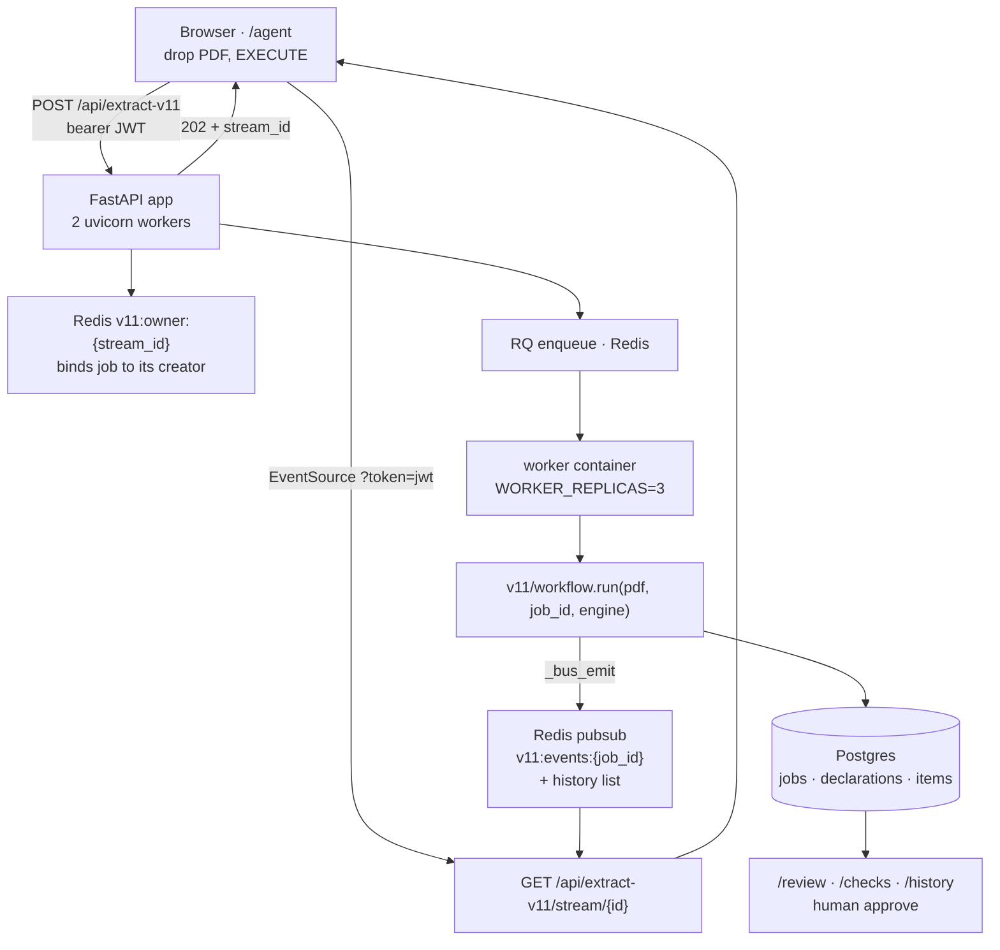
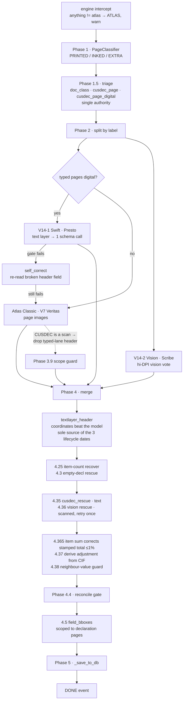
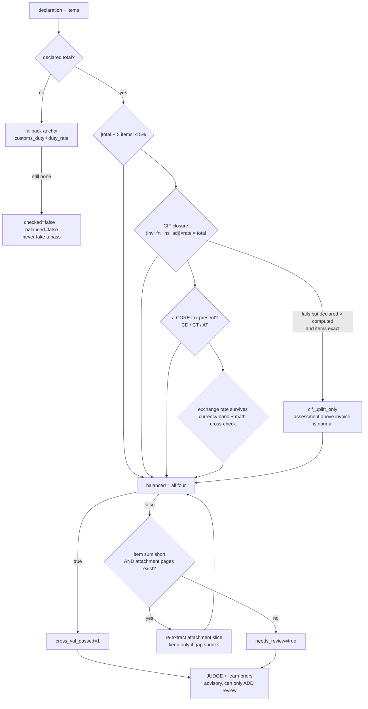
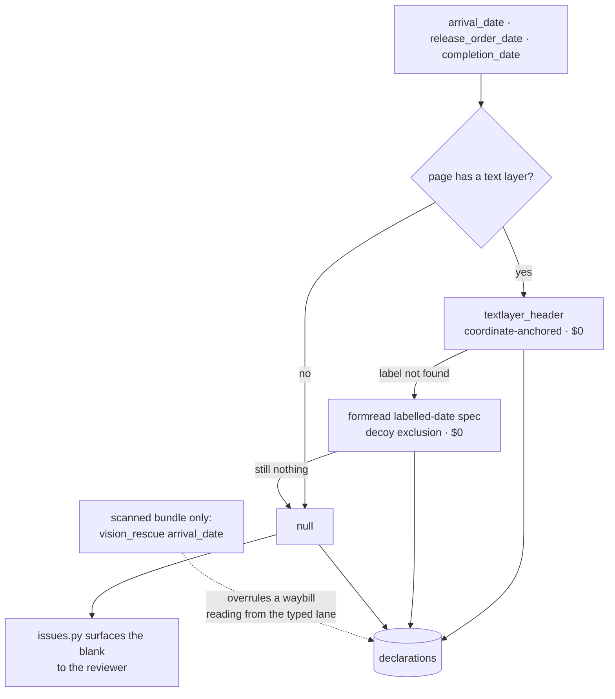
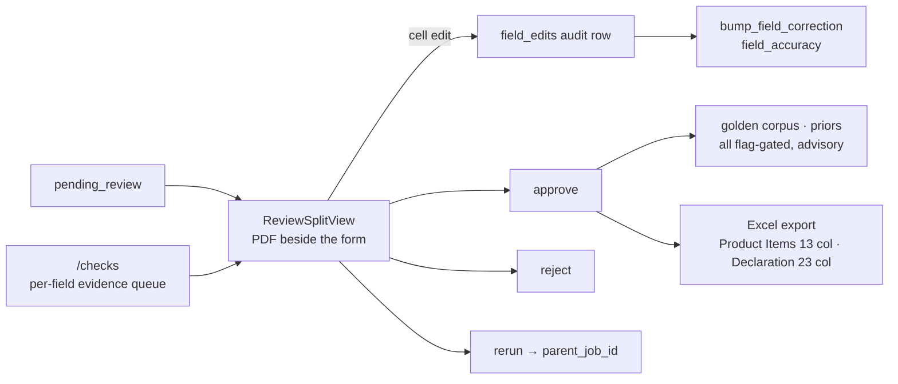

# FLOW.md — how a PDF becomes an approved declaration

State of the tree on 2 Aug 2026: **ATLAS V14 is the only engine.** ROVER PRO,
ROSETTA, `presto` and `classic` are retired; a request naming one is redirected to
ATLAS and the substitution is emitted, never done quietly.

---

## 1. Request → worker → browser

SSE replays history from Redis, so a page refresh reopens the stream and the whole
log comes back.

## 2. Inside ATLAS V14

## 3. The gate — `v11/tools/reconcile.py`

Advisory, never flips `balanced`: duty closure (exemptions legitimately break it)
and the per-row check (`value ≈ qty × price × rate` → `bad_rows`), which does force
review.

## 4. Where a header date comes from

The only diagram here that traces provenance rather than sequence. Since
4 Aug 2026 the three lifecycle dates — `arrival_date`, `release_order_date`,
`completion_date` — are read off the page and never asked of a model.

Blank is not broken. A scanned declaration has nothing for a reader to read,
and the model used to fill the empty row by echoing a neighbouring date — two
documents were found carrying an arrival date and a release-order date printed
nowhere in the file, both equal to that document's declaration date
(`rover/supervisor.flag_echoed_dates`). **A date has no arithmetic to fail, so
no gate catches it.** A reviewer can see a blank; they cannot see an echo.

`arrival_date` in `vision_rescue` is the deliberate exception: it is the only
thing that can overrule an arrival date the typed lane scraped off an
attachment, which is why `workflow.py` treats that source as authoritative.

The columns, the review screen, the `/declarations` date filter and the Excel
field map are unchanged — the team's ledger keys on the Release-Order date.

## 5. Human loop

Learning is subordinate to the arithmetic: JUDGE hard-interlock means a learned
hint can never override reconcile.
